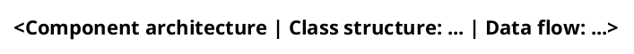

# Update architecture docs

`docs/architecture/README.md` is a narrative walkthrough of how this project works: what the main components are and how the primary data and control flows run through them, with diagrams embedded at the points in the story they support. It is a walkthrough, not an index.

`docs/architecture/` also holds the diagram sources as PlantUML (`.puml`) plus their rendered light `.svg`. Both are committed, so a reviewer sees the source diff and the rendered result.

`STEPS.md` is the index of the step vocabulary and is generated by `docs.php`. Never duplicate its per-step listing here: this document explains how a step reaches a browser or a Drupal API, not what each step does.

All content is derived from the actual source code: sources, entry scripts, manifests, and CI workflows. Never derive content from wishes, plans, or design documents. If the documentation and the code disagree, the code wins.

## Prerequisite

PlantUML must be on the `PATH`. Do not probe for it - run the render command and let it fail:

```bash
plantuml -tsvg docs/architecture/*.puml
```

If it reports that the command is missing, stop before rendering, say explicitly that the SVGs were not regenerated, and give the install instructions: `brew install plantuml` on macOS, `apt-get install plantuml` on Debian and Ubuntu. PlantUML is a Java application and needs a JRE or JDK 11 or later, which macOS does not ship; the Homebrew formula pulls OpenJDK in as a dependency, and `java -version` confirms what is present. Graphviz is required for class, component and activity diagrams, and Homebrew pulls that in too. Prose and `.puml` edits may still proceed.

## Task A: first generation

1. Analyze the codebase: entry points, sources, manifests, and workflows.
2. Identify the main components and the 1-3 primary data or control flows.
3. Draw the structure. Two diagrams are mandatory, and both are UML:
   - **A component diagram** (`architecture.puml`) - the packages and the runtime pieces around them, with the dependencies between them.
   - **A class diagram** (`class-*.puml`) - the real types: the trait inventory, the inheritance chain the context sits on, the `<<trait>>` stereotype, and the exceptions a failing step throws. Split it in two when one diagram would have to choose between breadth and member detail: an inventory diagram naming every type, and a detail diagram carrying members for a representative few.
4. Draw one sequence diagram per primary flow (`dataflow-<flow>.puml`).
5. Render every source to SVG, then confirm each `.svg` changed.
6. Write `docs/architecture/README.md` as a walkthrough that embeds each SVG where the prose discusses it, and keep the source index table near the top current.

## Task B: update after a structural change

1. Identify the components and flows the change affected.
2. Re-trace the affected `.puml` sources from the current code.
3. Re-render every SVG in the same pass, so the visuals and the prose can never drift apart.
4. Update the surrounding prose so the visuals and the prose agree.
5. Add any new diagram to the index table in `docs/architecture/README.md`.

A change is structural when it moves, adds, or removes a component or alters a flow between components: a new trait directory or namespace, a change to how `FeatureContext` composes traits, a change to how `docs.php` discovers or renders steps, a change to how the fixture site is provisioned, a change to the nested-Behat harness, or a change to the CI matrix. Adding a step to an existing trait, renaming step text, or fixing an assertion is not structural.

## Sources to trace from

The primary sources for this project, in the order they are usually read:

- `src/*.php` and `src/Drupal/*.php` - the step traits themselves, plus the two `HelperTrait` files that hold shared logic.
- `composer.json` - the published package surface, the PSR-4 map, and the `suggest` entries that mark per-trait optional dependencies.
- `docs.php` - the documentation generator that produces `STEPS.md` and the `README.md` step index.
- `behat.yml` - the suites, contexts, and extensions the test harness runs under.
- `tests/behat/bootstrap/` - `FeatureContext` and the nested-Behat harness in `BehatCliTrait`.
- `scripts/provision.sh`, `scripts/merge-coverage.php` - fixture-site provisioning and coverage merging.
- `.ahoy.yml` and `.github/workflows/test.yml` - the developer and CI entry points.

## Diagram conventions

Keep the header block identical across every source so the diagrams read as a set, and put the traced-from annotation in `'` comments at the top:



- Package colours are keyed by role: library green (`#E8F5E9`), Drupal blue (`#E3F2FD`), shared helpers purple (`#F3E5F5`), consuming project and documentation orange (`#FFF3E0`), runtime and targets slate (`#ECEFF1`), test harness red (`#FFEBEE`).
- Sequence diagrams use solid arrows (`->`) for the forward path and dashed (`-->`) for returns.
- Class diagrams set `skinparam classAttributeIconSize 0` and stereotype every PHP trait `<<trait>>`.
- A class diagram with many sibling types lays out unreadably wide by default. Chain them into columns with `-[hidden]down-` links and check the rendered aspect ratio before committing.
- **Escape a leading pair of `-` in a label.** PlantUML's Creole renders `--` as strikethrough, so a CLI flag is written `~--fail-on-change`.
- **A `#` at the start of a label line becomes a numbered list.** Reword rather than opening a label with a PHP attribute like `#[AfterScenario]`.

## Verification

Before finishing, confirm that every path named in a traced-from comment exists, that the prose around each diagram states only what those files show, and that every `.puml` has a matching `.svg` listed in the index table.

Then look at every diagram - one that renders without error can still be unreadably wide, and a Creole slip only shows up in the render:

```bash
plantuml -tpng -o ../../.artifacts/tmp docs/architecture/*.puml
```

PlantUML resolves a relative `-o` path against each **input** file, not the working directory, so `../../` climbs out of `docs/architecture/` to the repository root. It creates the directory if it is missing. Open each generated PNG in an image viewer before committing.
