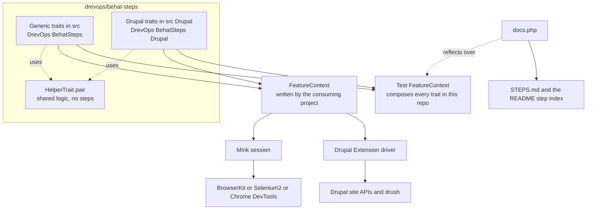
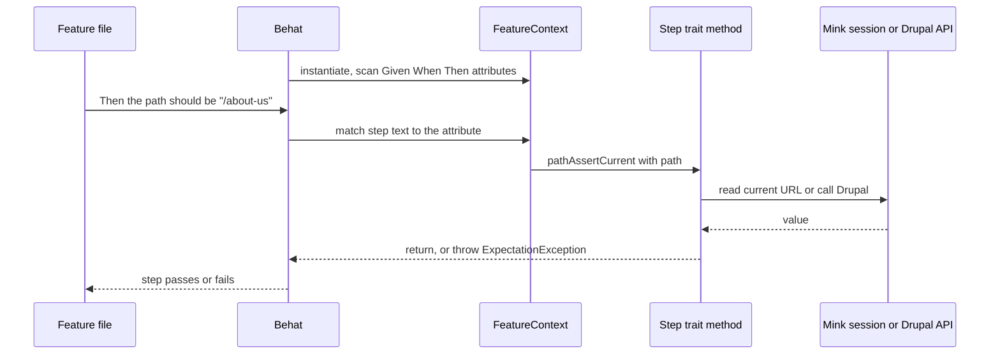
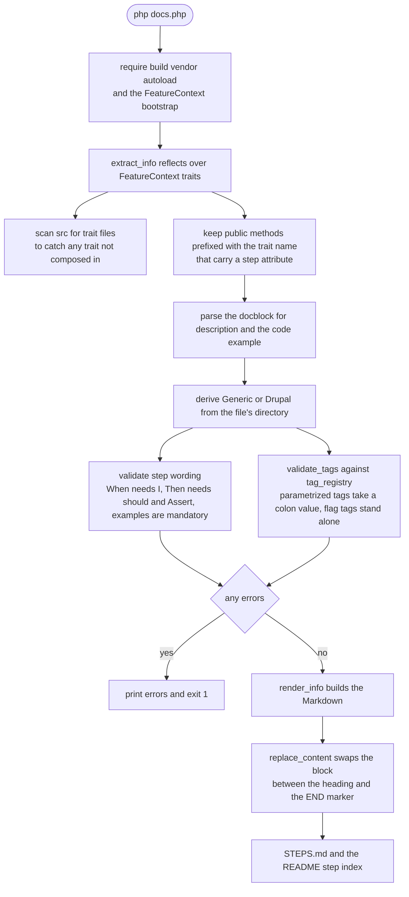
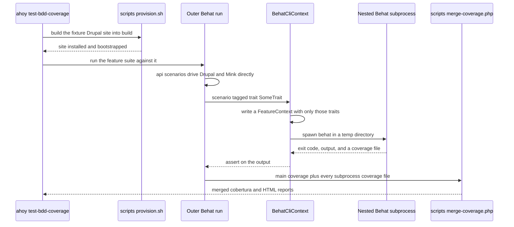

# Architecture

This is a walkthrough of how Behat Steps works: what the pieces are, and how a Gherkin step travels from a feature file to a browser or a Drupal API. Each section is traced from the sources it names, and the diagrams sit next to the prose that explains them.

This document is generated and maintained by an AI agent via the `update-architecture-docs` skill in [.claude/skills/update-architecture-docs/SKILL.md](.claude/skills/update-architecture-docs/SKILL.md). The content is derived from the source code. If this documentation and the code disagree, the code wins.

Looking for the list of steps instead? That's [STEPS.md](STEPS.md), and it's generated too.

## What actually ships

The published package is a library of PHP traits and nothing else. There's no context class to extend, no service container, no bootstrap. A consuming project writes its own `FeatureContext`, `use`s the traits it wants, and Behat picks up the steps from there.

Traits live in 2 places, and the split is meaningful:

- `src/*.php` in the `DrevOps\BehatSteps` namespace - the generic ones. They talk to Mink and know nothing about Drupal. `PathTrait`, `ElementTrait`, `JsonTrait`, `ResponsiveTrait`, `CommandTrait` and friends.
- `src/Drupal/*.php` in `DrevOps\BehatSteps\Drupal` - the Drupal ones. They call `\Drupal::` APIs and build on the Drupal Extension's driver. `ContentTrait`, `UserTrait`, `MediaTrait`, `WatchdogTrait`, and so on.

That directory split isn't just tidiness. `docs.php` reads a trait's context straight off its directory, so a file's location decides which index it lands in.

Each trait carries its steps as PHP attributes - `#[Given]`, `#[When]`, `#[Then]` from `Behat\Step\*` - sitting directly on the method that implements them. There's no `.yml` mapping and no separate registration step. The docblock above the method isn't decoration either: `docs.php` parses it, and the `@code` example inside it is mandatory.

The dependency story is deliberately thin. `composer.json` requires only PHP 8.2+, `behat/behat` and `behat/mink`. Everything else - the Drupal Extension, the JSON Schema validator, the JSONPath library, both JavaScript drivers - sits in `require-dev` and is advertised through `suggest`. A project that only wants the generic traits doesn't drag Drupal in.

## Flow 1: a step runs

Nothing in this library is invoked directly. Behat owns the loop, and the traits are just where the matching methods happen to live.

When Behat starts, it instantiates the consuming project's `FeatureContext` and scans it for step attributes - including every attribute inherited through a `use` statement. From then on, matching a Gherkin line to a method is ordinary Behat behaviour. The trait method runs with `$this` bound to the context, which is how `$this->getSession()` reaches Mink and how the Drupal traits reach the driver they were composed alongside.

Assertions fail by throwing. Traits with a Mink session throw `Behat\Mink\Exception\ExpectationException` and pass the driver as the second argument so the failure message carries page context; a missing element throws `ElementNotFoundException`. Bad step arguments and unmet prerequisites are a different thing entirely and throw `\RuntimeException` - which is what lets a consuming project tell "the assertion didn't hold" apart from "you called this wrong".

### Shared logic and lifecycle hooks

2 traits carry no steps at all: `src/HelperTrait.php` and `src/Drupal/HelperTrait.php`. They hold the logic that would otherwise be copy-pasted - table transposition, whitespace normalisation, comma-splitting, fixture-file resolution - and roughly 20 step traits `use` one of them.

The Drupal `HelperTrait` also owns entity cleanup, which is the one piece of cross-trait state in the library. Traits that create entities call `entityRegister()`, and an `#[AfterScenario('@api')]` hook deletes the registry in reverse creation order at teardown. Ids are stored as scalars rather than objects, so each entity is reloaded fresh and an already-deleted row is simply skipped.

Every lifecycle hook in the library can be switched off from a feature file. Tag a scenario `@behat-steps-skip:JavascriptTrait` to opt a whole trait out, or `@behat-steps-skip:fileDownloadBeforeScenario` to disable a single hook - the hooks check `$scope->getScenario()->hasTag()` themselves. Entity cleanup honours the same convention, plus `@behat-steps-entity-cleanup-skip:<entity_type>` for leaving one type in place.

## Flow 2: the step documentation generates itself

`STEPS.md` is entirely generated, and `docs.php` is what generates it. It's a plain procedural script - top-level functions, no classes - and it runs against the fixture site's autoloader because it needs to reflect over real Drupal-dependent traits.

The trick is that it doesn't scan the filesystem for step definitions. It reflects over the test suite's own `FeatureContext`, which composes every trait in the library. That makes composition the source of truth: a trait file that exists but was never added to `FeatureContext` shows up as an error rather than being quietly skipped.

The validation half matters more than the rendering half. It's where the project's step-writing conventions stop being a style guide and start being enforced: a `@When` step without `I `, a `@Then` step whose method name lacks `Assert`, a method with 2 step attributes, a step with no `@code` example - each is a hard error. `tag_registry()` does the same job for tags, guarding against separator drift so that `@module:views` never quietly becomes `@module-views`.

Run with `--fail-on-change` (that's `ahoy lint-docs`), the script becomes a CI gate: it regenerates the blocks in memory and fails if they don't match what's committed. So the documentation can't drift, because a drifted build is a red build.

## Flow 3: how the library tests itself

This is the interesting part, and it's genuinely a bit unusual. A library of Drupal test steps can't be tested without a Drupal site, so the repository builds one - and then, for the failure paths, runs Behat inside Behat.

### Building the fixture site

`scripts/provision.sh` creates a throwaway Drupal site under `build/`. It copies a version-pinned fixture from `tests/behat/fixtures_drupal/d10/` or `d11/`, then merges the library's own Composer requirements into that fixture's `composer.json` - including every package named in `suggest`, because the fixture site has to exercise all the traits at once. It installs Drupal with `drush si standard`, appends a couple of `$config` overrides to `settings.php` so `ConfigOverrideTrait` has something real to read, copies `tests/behat/fixtures/` into the site's files directory, and confirms the site bootstraps before handing back.

Behat then runs from inside `build/` but with the project-root `behat.yml`, which is why several paths in the config look one level off.

### The suite

`behat.yml` wires up `FeatureContext` (all the library traits plus test-only overrides), `BehatCliContext` (the nested runner), the Drupal Extension's Mink, Markup and Message contexts, the screenshot extension, and a PHP built-in server that serves `tests/behat/fixtures/` on port 8888 for the traits that need a static file and no Drupal at all.

Default sessions run through BrowserKit. `@javascript` scenarios run through Selenium2, or through headless Chrome over the DevTools Protocol if you use the `chrome_headless` profile - which inherits everything and swaps only the JavaScript session, so the same suite proves the steps are driver-portable.

### Behat inside Behat

Asserting that a step *fails correctly* is awkward from inside the same run: the failure would fail your own scenario. So scenarios tagged `@trait:SomeTrait` take a detour.

`BehatCliTrait::behatCliBeforeScenario` reads the trait names out of the tag, writes a minimal `FeatureContext` composing just those traits into a temporary directory, and `BehatCliContext` runs a real `behat` subprocess against it. The outer scenario then asserts on the subprocess's exit code and output. One quirk worth knowing: nested PyStrings are written with `'''` and converted to `"""` on the way out, because you can't nest `"""` inside `"""` in Gherkin.

### Coverage, and the file everyone reads wrong

Because half the failure paths are only ever exercised inside subprocesses, coverage arrives in 2 pieces and has to be stitched together.

The outer run writes `.logs/coverage/behat/`. Each nested subprocess drops its own file into `.logs/coverage/behat_cli/phpcov/`. `scripts/merge-coverage.php` folds them together and writes the merged report to `.logs/coverage/behat_cli/cobertura.xml`.

That merged file is the real number. The `behat/` one only ever shows the direct scenarios, so it reads lower - which is exactly the kind of thing that sends someone off chasing coverage that already exists. `scripts/check-coverage.php` defaults to the merged file for that reason.

Alongside all this, `tests/phpunit/` holds ordinary unit tests for the parts that don't need a browser: `docs.php` itself, and the pure helper logic in a handful of traits.

## Continuous integration

`.github/workflows/test.yml` has 2 jobs, both running inside the project's own Docker Compose stack so CI and local development execute the same commands.

`lint` provisions the fixture site and runs `ahoy lint` (PHP_CodeSniffer, PHPStan, Rector in dry-run mode, and gherkinlint over the feature files) followed by `ahoy lint-docs`, which is the `docs.php --fail-on-change` gate.

`test` is a matrix of PHP 8.2 to 8.5 against Drupal 10 and 11, each combination run twice - once with `normal` dependency resolution and once with `lowest`. The corners are trimmed where they'd be pointless: PHP 8.2 runs Drupal 10 only, and PHP 8.5 runs Drupal 11 only, because Drupal 10 doesn't support it. On top of that sit 2 extra legs that run the whole suite through the Selenium-less `chrome_headless` driver, on Drupal 10 and 11.

Unit and BDD tests run on every leg. Coverage is collected on the PHP 8.3 / Drupal 11 / normal leg and on the Drupal 11 Chrome leg, then uploaded to Codecov. Test artifacts - logs, screenshots, coverage - come back from every leg, passing or failing.

## Regenerating this document

After a structural change - a new trait directory, a change to how `FeatureContext` composes traits, a change to how `docs.php` discovers steps, a change to the fixture harness or the CI matrix - ask the AI agent to "update architecture docs". It re-traces the affected diagrams and prose from the current code via the `update-architecture-docs` skill.
