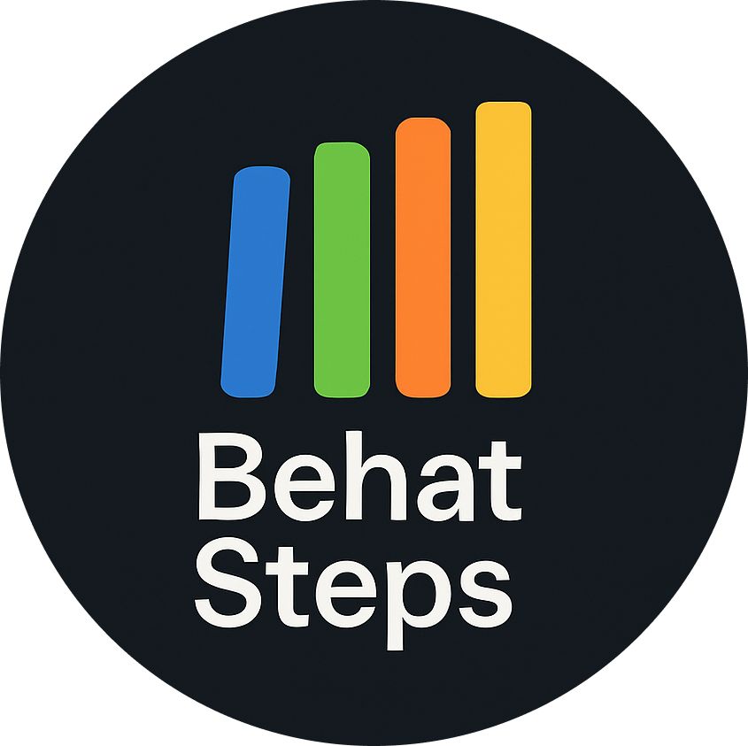

<p align="center">
  <a href="" rel="noopener"></a>
</p>

<h1 align="center">A collection of Behat steps</h1>

<div align="center">

[](https://github.com/DrevOps/behat-steps/issues)
[](https://github.com/DrevOps/behat-steps/pulls)
[](https://circleci.com/gh/drevops/behat-steps)
[](https://codecov.io/gh/drevops/bats-helpers)


[](https://packagist.org/packages/drevops/behat-steps)

</div>

---

## What is it?

This library is a collection of reusable testing actions and assertions for
automated testing with [Behat](https://behat.org). It’s designed to help you
write reliable, readable, and maintainable tests faster.

We provide a set of generic traits that can be used in any PHP project, with
special support for Drupal through additional step definitions. All methods are
properly namespaced, so they won’t conflict with your existing custom step definitions.

Our goal is to make this a go-to library for Behat steps. We maintain strong
test coverage to avoid false positives and negatives, and follow [clear
guidelines](CONTRIBUTING.md#steps-format) to keep the step language consistent.

We actively maintain this package and welcome [contributions](CONTRIBUTING.md)
from the community.

## Available steps

### Index of Generic steps

| Class | Description |
| --- | --- |
| [CookieTrait](STEPS.md#cookietrait) | Verify and inspect browser cookies. |
| [DateTrait](STEPS.md#datetrait) | Convert relative date expressions into timestamps or formatted dates. |
| [ElementTrait](STEPS.md#elementtrait) | Interact with HTML elements using CSS selectors and DOM attributes. |
| [FieldTrait](STEPS.md#fieldtrait) | Manipulate form fields and verify widget functionality. |
| [FileDownloadTrait](STEPS.md#filedownloadtrait) | Test file download functionality with content verification. |
| [KeyboardTrait](STEPS.md#keyboardtrait) | Simulate keyboard interactions in Drupal browser testing. |
| [LinkTrait](STEPS.md#linktrait) | Verify link elements with attribute and content assertions. |
| [PathTrait](STEPS.md#pathtrait) | Navigate and verify paths with URL validation. |
| [ResponseTrait](STEPS.md#responsetrait) | Verify HTTP responses with status code and header checks. |
| [WaitTrait](STEPS.md#waittrait) | Wait for a period of time or for AJAX to finish. |

### Index of Drupal steps

| Class | Description |
| --- | --- |
| [Drupal\BigPipeTrait](STEPS.md#drupalbigpipetrait) | Bypass Drupal BigPipe when rendering pages. |
| [Drupal\BlockTrait](STEPS.md#drupalblocktrait) | Manage Drupal blocks. |
| [Drupal\ContentBlockTrait](STEPS.md#drupalcontentblocktrait) | Manage Drupal content blocks. |
| [Drupal\ContentTrait](STEPS.md#drupalcontenttrait) | Manage Drupal content with workflow and moderation support. |
| [Drupal\DraggableviewsTrait](STEPS.md#drupaldraggableviewstrait) | Order items in the Drupal Draggable Views. |
| [Drupal\EckTrait](STEPS.md#drupalecktrait) | Manage Drupal ECK entities with custom type and bundle creation. |
| [Drupal\EmailTrait](STEPS.md#drupalemailtrait) | Test Drupal email functionality with content verification. |
| [Drupal\FileTrait](STEPS.md#drupalfiletrait) | Manage Drupal file entities with upload and storage operations. |
| [Drupal\MediaTrait](STEPS.md#drupalmediatrait) | Manage Drupal media entities with type-specific field handling. |
| [Drupal\MenuTrait](STEPS.md#drupalmenutrait) | Manage Drupal menu systems and menu link rendering. |
| [Drupal\MetatagTrait](STEPS.md#drupalmetatagtrait) | Assert `<meta>` tags in page markup. |
| [Drupal\OverrideTrait](STEPS.md#drupaloverridetrait) | Override Drupal Extension behaviors. |
| [Drupal\ParagraphsTrait](STEPS.md#drupalparagraphstrait) | Manage Drupal paragraphs entities with structured field data. |
| [Drupal\SearchApiTrait](STEPS.md#drupalsearchapitrait) | Assert Drupal Search API with index and query operations. |
| [Drupal\TaxonomyTrait](STEPS.md#drupaltaxonomytrait) | Manage Drupal taxonomy terms with vocabulary organization. |
| [Drupal\TestmodeTrait](STEPS.md#drupaltestmodetrait) | Configure Drupal Testmode module for controlled testing scenarios. |
| [Drupal\UserTrait](STEPS.md#drupalusertrait) | Manage Drupal users with role and permission assignments. |
| [Drupal\WatchdogTrait](STEPS.md#drupalwatchdogtrait) | Assert Drupal does not trigger PHP errors during scenarios using Watchdog. |


[//]: # (END)

## Installation

```bash
composer require --dev drevops/behat-steps:^3
```

> [!TIP]
> Upgrading from [`2.x`](https://github.com/drevops/behat-steps/tree/2.x)?
> We’ve updated the steps language for greater consistency
> and clarity. Please refer to the [migration map](MIGRATION.md) to see the
> changes. An automated migration script is not included, but an AI-guided migration prompt is provided below.

<details>
<summary><strong>🤖 Expand to get an AI prompt for features migration</strong></summary>

Copy and paste below into your agentic AI client chat.

```
# Guide to Updating Behat Steps Package in Drupal Projects

This guide explains how to update the drevops/behat-steps package to the latest version and update your Behat tests to work with the new step definitions.

## Overview of the Update Process

1. Update the package version in composer.json
2. Update namespace imports in FeatureContext.php
3. Update step definitions in feature files
4. Test and fix each feature file

## Step-by-Step Instructions

### 1. Update the Package

First, check your current version of drevops/behat-steps in composer.json. Then update to the latest version (3.0.1 or newer) using your project's package management tool.

### 2. Fix FeatureContext.php

The namespace structure has changed in version 3.0.1. You'll need to update your FeatureContext.php file:

1. Locate your FeatureContext.php file (typically in tests/behat/bootstrap/)
2. Update the namespace imports at the top of the file
   - Generic traits are now in the root namespace: `DrevOps\BehatSteps\`
   - Drupal-specific traits are now in a subdirectory: `DrevOps\BehatSteps\Drupal\`

For example, change:

    use DrevOps\BehatSteps\ContentTrait;
    use DrevOps\BehatSteps\FileTrait;

To:

    use DrevOps\BehatSteps\Drupal\ContentTrait;
    use DrevOps\BehatSteps\Drupal\FileTrait;

Non-Drupal traits remain in the root namespace:

    use DrevOps\BehatSteps\LinkTrait;
    use DrevOps\BehatSteps\PathTrait;
    use DrevOps\BehatSteps\ResponseTrait;
    use DrevOps\BehatSteps\WaitTrait;

### 3. Consult the STEPS.md File

**This is the most important reference for the update process!**

The drevops/behat-steps package includes a comprehensive STEPS.md file that documents all available steps. After updating the package:

1. Locate this file at `vendor/drevops/behat-steps/STEPS.md`
2. Review this file thoroughly - it contains all available steps with examples
3. Use this as your primary reference when updating feature files

The STEPS.md file is organized into sections:
- Generic steps (Cookie, Date, Element, Path, etc.)
- Drupal-specific steps (Content, Field, File, Media, etc.)

Each section includes detailed examples of how to use the steps, which is invaluable for updating your tests correctly.

### 4. Find and Update Feature Files

Examine your feature files (typically in tests/behat/features/) and update step definitions to match the new format from STEPS.md:

#### Common Changes Needed:

1. **Path Assertions**:
   - Change: `I should be in the "path" path`
   - To: `the path should be "path"`

2. **HTTP Response Assertions**:
   - Change: `I should get a 200 HTTP response`
   - To: `the response status code should be 200`

3. **Response Header Assertions**:
   - Change: `response header "X-Header" contains "value"`
   - To: `the response header "X-Header" should contain the value "value"`

4. **Link Interaction**:
   - Change: `I click the link with title "Title"`
   - To: `I click on the link with the title "Title"` or simply `I click "Title"`

5. **Wait Steps**:
   - Change: `I wait 2 seconds`
   - To: `I wait for 2 seconds`

6. **File Creation**:
   - Change: `unmanaged file "public://file.txt" created with content "content"`
   - To: `the unmanaged file at the URI "public://file.txt" exists with "content"`

7. **Content Visiting**:
   - Change: `I visit content_type "Title"`
   - To: `I visit the "content_type" content page with the title "Title"`

### 5. Reference Available Steps

There are two ways to see all available steps in the new package:

1. **STEPS.md File (Recommended)**:
   - This is the most comprehensive and user-friendly reference
   - Contains examples and descriptions for each step
   - Located at `vendor/drevops/behat-steps/STEPS.md`

2. **Behat Definitions Command**:
   - Use the Behat definitions command appropriate for your system:

       vendor/bin/behat --definitions=i

   - This will show all available step definitions but with less context than STEPS.md

Always refer to STEPS.md first, as it provides clearer examples and more detailed information about each step.

### 6. Test Each Feature File

After updating step definitions:

1. Run each feature file individually to identify any issues
2. For failing tests, check screenshots if available to help diagnose the problems
3. Add `@skipped` tag to features that aren't ready to run (you can fix these later)
4. Once individual files pass, run the entire test suite

### 7. Common Troubleshooting

- **Step Not Found**: Verify you're using the current step syntax by checking the step definitions
- **Element Not Found**: The site structure may have changed - update selectors or navigation paths
- **Form Submission Issues**: For form tests, consider checking for broader success indicators rather than specific messages

### Reference Information

The STEPS.md file is your most important reference during this process. It contains:

1. Complete documentation of all available steps
2. Clear examples showing the exact format for each step
3. Descriptions of what each step does
4. Organization by trait/functionality for easy browsing

After updating the package, you should immediately locate and bookmark this file:

    vendor/drevops/behat-steps/STEPS.md

If you need to understand specific Behat step behavior in detail, this file should be your first resource.

## Example: Updating a Contact Form Feature

Before:

    Scenario: User submits a form
      Given I am on the homepage
      And I click the link with title "Contact"
      When I fill in "Name" with "Test User"
      And I press "Send message"
      Then I should see the text "Your message has been sent."

After:

    Scenario: User submits a form
      Given I am on the homepage
      And I click "Contact"
      When I fill in "Name" with "Test User"
      And I press "Send message"
      Then I should not see an "#edit-submit" element
```

</details>


## Usage

Add required traits to your
`FeatureContext.php` ([example](tests/behat/bootstrap/FeatureContext.php)):

```php
<?php

use DrevOps\BehatSteps\CookieTrait;

/**
 * Defines application features from the specific context.
 */
class FeatureContext extends DrupalContext {

  use CookieTrait;

}
```

Ensure that your [`behat.yml`](behat.yml) has all the required extensions
enabled.

### Exceptions

- `\Exception` is thrown when an assertion fails.
- `\RuntimeException` is thrown when a step does not have enough contextual
  information to perform an action.

### Skipping before scenario hooks

Some traits provide `beforeScenario` hook implementations. These can be disabled
by adding `@behat-steps-skip:METHOD_NAME` tag to your test.

For example, to skip `beforeScenario` hook from `ElementTrait`, add
`@behat-steps-skip:ElementTrait` tag to the feature.

## Development

See [CONTRIBUTING.md](CONTRIBUTING.md) for details on how to contribute to
this project.

---
_Repository created using https://getscaffold.dev/ project scaffold template_
