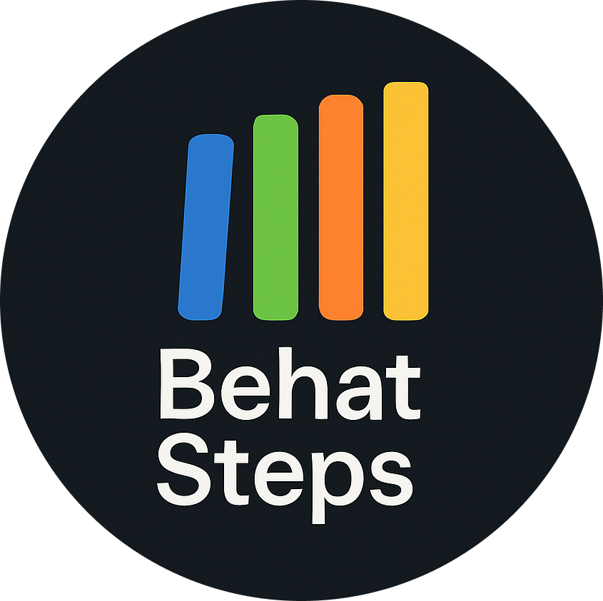

<p align="center">
  <a href="" rel="noopener"></a>
</p>

<h1 align="center">A collection of Behat steps</h1>

<div align="center">

[](https://github.com/DrevOps/behat-steps/issues)
[](https://github.com/DrevOps/behat-steps/pulls)
[](https://github.com/drevops/behat-steps/actions/workflows/test.yml)
[](https://codecov.io/gh/drevops/behat-steps)


[](https://packagist.org/packages/drevops/behat-steps)

[](https://github.com/drevops/vortex)
</div>

---

## What is it?

This library is a collection of reusable testing actions and assertions for
automated testing with [Behat](https://behat.org). It’s designed to help you
write reliable, readable, and maintainable tests faster.

We provide a set of generic traits that can be used in any PHP project, with
special support for Drupal through additional step definitions. All methods are
properly namespaced, so they won’t conflict with your existing custom step
definitions.

Our goal is to make this a go-to library for Behat steps. We maintain solid
[test coverage](tests/behat/features) to avoid false positives and negatives,
and follow [clear
guidelines](CONTRIBUTING.md#steps-format) to keep the step language consistent.

We actively maintain this package and welcome [contributions](CONTRIBUTING.md)
from the community.

## Available steps

### Index of Generic steps

| Class | Description |
| --- | --- |
| [CookieTrait](STEPS.md#cookietrait) | Verify and inspect browser cookies. |
| [DateTrait](STEPS.md#datetrait) | Convert relative date expressions into timestamps or formatted dates. |
| [ElementTrait](STEPS.md#elementtrait) | Interact with HTML elements using CSS selectors and DOM attributes. |
| [FieldTrait](STEPS.md#fieldtrait) | Manipulate form fields and verify widget functionality. |
| [FileDownloadTrait](STEPS.md#filedownloadtrait) | Test file download functionality with content verification. |
| [IframeTrait](STEPS.md#iframetrait) | Switch between iframes and the root document. |
| [JavascriptTrait](STEPS.md#javascripttrait) | Automatically detect JavaScript errors during test execution. |
| [KeyboardTrait](STEPS.md#keyboardtrait) | Simulate keyboard interactions in Drupal browser testing. |
| [LinkTrait](STEPS.md#linktrait) | Verify link elements with attribute and content assertions. |
| [MetatagTrait](STEPS.md#metatagtrait) | Assert `<meta>` tags in page markup. |
| [ModalTrait](STEPS.md#modaltrait) | Interact with and assert modals. |
| [PathTrait](STEPS.md#pathtrait) | Navigate and verify paths with URL validation. |
| [ResponseTrait](STEPS.md#responsetrait) | Verify HTTP responses with status code and header checks. |
| [ResponsiveTrait](STEPS.md#responsivetrait) | Test responsive layouts with viewport control. |
| [RestTrait](STEPS.md#resttrait) | Lightweight REST API testing with no Drupal dependencies. |
| [TableTrait](STEPS.md#tabletrait) | Interact with HTML table elements and assert their content. |
| [WaitTrait](STEPS.md#waittrait) | Wait for a period of time or for AJAX to finish. |
| [XmlTrait](STEPS.md#xmltrait) | Assert XML responses with element and attribute checks. |

### Index of Drupal steps

| Class | Description |
| --- | --- |
| [Drupal\BigPipeTrait](STEPS.md#drupalbigpipetrait) | Bypass Drupal BigPipe when rendering pages. |
| [Drupal\BlockTrait](STEPS.md#drupalblocktrait) | Manage Drupal blocks. |
| [Drupal\CacheTrait](STEPS.md#drupalcachetrait) | Invalidate specific Drupal caches from within a scenario. |
| [Drupal\ConfigOverrideTrait](STEPS.md#drupalconfigoverridetrait) | Disable Drupal config overrides from settings.php during a scenario. |
| [Drupal\ContentBlockTrait](STEPS.md#drupalcontentblocktrait) | Manage Drupal content blocks. |
| [Drupal\ContentTrait](STEPS.md#drupalcontenttrait) | Manage Drupal content with workflow and moderation support. |
| [Drupal\DraggableviewsTrait](STEPS.md#drupaldraggableviewstrait) | Order items in the Drupal Draggable Views. |
| [Drupal\EckTrait](STEPS.md#drupalecktrait) | Manage Drupal ECK entities with custom type and bundle creation. |
| [Drupal\EmailTrait](STEPS.md#drupalemailtrait) | Test Drupal email functionality with content verification. |
| [Drupal\FileTrait](STEPS.md#drupalfiletrait) | Manage Drupal file entities with upload and storage operations. |
| [Drupal\MediaTrait](STEPS.md#drupalmediatrait) | Manage Drupal media entities with type-specific field handling. |
| [Drupal\MenuTrait](STEPS.md#drupalmenutrait) | Manage Drupal menu systems and menu link rendering. |
| [Drupal\ModuleTrait](STEPS.md#drupalmoduletrait) | Enable and disable Drupal modules with automatic state restoration. |
| [Drupal\OverrideTrait](STEPS.md#drupaloverridetrait) | Override Drupal Extension behaviors. |
| [Drupal\ParagraphsTrait](STEPS.md#drupalparagraphstrait) | Manage Drupal paragraphs entities with structured field data. |
| [Drupal\QueueTrait](STEPS.md#drupalqueuetrait) | Manage and assert Drupal queue state. |
| [Drupal\SearchApiTrait](STEPS.md#drupalsearchapitrait) | Assert Drupal Search API with index and query operations. |
| [Drupal\StateTrait](STEPS.md#drupalstatetrait) | Manage and assert Drupal State API values with automatic revert. |
| [Drupal\TaxonomyTrait](STEPS.md#drupaltaxonomytrait) | Manage Drupal taxonomy terms with vocabulary organization. |
| [Drupal\TestmodeTrait](STEPS.md#drupaltestmodetrait) | Configure Drupal Testmode module for controlled testing scenarios. |
| [Drupal\TimeTrait](STEPS.md#drupaltimetrait) | Control system time in tests using Drupal state overrides. |
| [Drupal\UserTrait](STEPS.md#drupalusertrait) | Manage Drupal users with role and permission assignments. |
| [Drupal\WatchdogTrait](STEPS.md#drupalwatchdogtrait) | Assert Drupal does not trigger PHP errors during scenarios using Watchdog. |
| [Drupal\WebformTrait](STEPS.md#drupalwebformtrait) | Manage Drupal webforms. |


[//]: # (END)

## Installation

```bash
composer require --dev drevops/behat-steps:^3
```

## Usage

Add required traits to your
`FeatureContext.php` ([example](tests/behat/bootstrap/FeatureContext.php)):

```php
<?php

use DrevOps\BehatSteps\CookieTrait;

/**
 * Defines application features from the specific context.
 */
class FeatureContext extends DrupalContext {

  use CookieTrait;

}
```

Ensure that your [`behat.yml`](behat.yml) has all the required extensions
enabled.

### Exceptions

This library uses [Mink exception classes](https://mink.behat.org/en/latest/)
for
consistent error handling:

| Exception                          | When thrown                                          |
|------------------------------------|------------------------------------------------------|
| `ElementNotFoundException`         | Element, field, link, or selector not found on page  |
| `ExpectationException`             | Assertion fails (value mismatch, state verification) |
| `UnsupportedDriverActionException` | Feature requires specific driver (e.g., Selenium)    |
| `\RuntimeException`                | Invalid input or processing error (not an assertion) |

Example error messages:

```
Element matching css "#my-element" not found.
Link with title "My Link" not found.
Select with id|name|label "My Select" not found.
The cookie with name "session" was not set.
```

### Skipping before scenario hooks

Some traits provide `beforeScenario` hook implementations. These can be disabled
by adding `@behat-steps-skip:METHOD_NAME` tag to your test.

For example, to skip `beforeScenario` hook from `ElementTrait`, add
`@behat-steps-skip:ElementTrait` tag to the feature.

## Writing tests with AI assistants

Copy and paste below into your project's `CLAUDE.md` or `AGENTS.md` file.

```
## Writing Behat Tests

Available step definitions are listed in `.behat-steps.txt`.
Read this file before writing or modifying Behat tests.
Use only step patterns from this file. Do not invent steps.

If `.behat-steps.txt` does not exist or is outdated, regenerate it:

    ./vendor/bin/behat --definitions=i > .behat-steps.txt

Regenerate after adding new step traits or updating dependencies.

For detailed examples, see: vendor/drevops/behat-steps/STEPS.md
```

## Development

See [CONTRIBUTING.md](CONTRIBUTING.md) for details on how to contribute to
this project.

---
_This repository was created using the [Scaffold](https://getscaffold.dev/)
project template_
