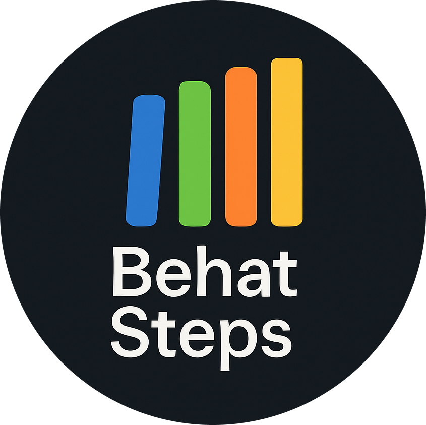

<p align="center">
  <a href="" rel="noopener"></a>
</p>

<h1 align="center">A collection of Behat steps</h1>

<div align="center">

[](https://github.com/DrevOps/behat-steps/issues)
[](https://github.com/DrevOps/behat-steps/pulls)
[](https://github.com/drevops/behat-steps/actions/workflows/test.yml)
[](https://codecov.io/gh/drevops/behat-steps)


[](https://packagist.org/packages/drevops/behat-steps)

[](https://github.com/drevops/vortex)

[](https://drupal.slack.com/archives/C4T2JHG9K)
</div>

---

## What is it?

This library is a collection of reusable testing actions and assertions for
automated testing with [Behat](https://behat.org). It’s designed to help you
write reliable, readable, and maintainable tests faster.

We provide a set of generic traits that can be used in any PHP project, with
special support for Drupal through additional step definitions. All methods are
properly namespaced, so they won’t conflict with your existing custom step
definitions.

Our goal is to make this a go-to library for Behat steps. We maintain solid
[test coverage](tests/behat/features) to avoid false positives and negatives,
and follow [clear
guidelines](CONTRIBUTING.md#steps-format) to keep the step language consistent.

We actively maintain this package and welcome [contributions](CONTRIBUTING.md)
from the community.

## Supported versions

| Version | Behat | Drupal | PHP | Support |
| --- | --- | --- | --- | --- |
| 4.x | 3.33+, 4 | 11, 12 | 8.3, 8.4, 8.5 | Active development |
| 3.x | 3 | 10, 11 | 8.2, 8.3, 8.4, 8.5 | The current minor is LTS until 1 July 2027 and receives bugfixes and security updates only. |
| 2.x | 3 | 9, 10 | 8.2+ | Unsupported |

See [MIGRATION.md](MIGRATION.md) for migration guides.

## Available steps

### Index of Web steps

| Class | Description |
| --- | --- |
| [AccessibilityTrait](STEPS.md#accessibilitytrait) | Assess accessibility of rendered pages. |
| [BasicAuthTrait](STEPS.md#basicauthtrait) | Keep HTTP basic authentication applied across session resets. |
| [CommandTrait](STEPS.md#commandtrait) | Run local shell commands and assert on their result. |
| [CookieTrait](STEPS.md#cookietrait) | Verify and inspect browser cookies. |
| [DateTrait](STEPS.md#datetrait) | Convert relative date expressions into timestamps or formatted dates. |
| [DiagnosticsTrait](STEPS.md#diagnosticstrait) | Append on-failure diagnostics to the failure message of any failed step. |
| [DropzoneTrait](STEPS.md#dropzonetrait) | Simulate a real multi-file drag-and-drop gesture onto a Dropzone target. |
| [ElementTrait](STEPS.md#elementtrait) | Interact with HTML elements using CSS selectors and DOM attributes. |
| [FieldTrait](STEPS.md#fieldtrait) | Manipulate form fields and verify widget functionality. |
| [FileDownloadTrait](STEPS.md#filedownloadtrait) | Test file download functionality with content verification. |
| [IframeTrait](STEPS.md#iframetrait) | Switch between iframes and the root document. |
| [JavascriptTrait](STEPS.md#javascripttrait) | Automatically detect JavaScript errors during test execution. |
| [JsonTrait](STEPS.md#jsontrait) | Assert JSON responses with path and schema checks. |
| [KeyboardTrait](STEPS.md#keyboardtrait) | Simulate keyboard interactions in Drupal browser testing. |
| [LinkTrait](STEPS.md#linktrait) | Verify link elements with attribute and content assertions. |
| [MappingTrait](STEPS.md#mappingtrait) | Replace `{{ Key }}` tokens in step arguments and table cells. |
| [MessageTrait](STEPS.md#messagetrait) | Assert status, error, warning and success messages rendered on the page. |
| [MetatagTrait](STEPS.md#metatagtrait) | Assert `<meta>` tags and head/SEO markup in page markup. |
| [ModalTrait](STEPS.md#modaltrait) | Interact with and assert modals. |
| [PathTrait](STEPS.md#pathtrait) | Navigate and verify paths with URL validation. |
| [RandomTrait](STEPS.md#randomtrait) | Replace random-value tokens in step arguments and table cells. |
| [RegionTrait](STEPS.md#regiontrait) | Interact with and assert against named page regions. |
| [ResponseTrait](STEPS.md#responsetrait) | Verify HTTP responses with status code and header checks. |
| [ResponsiveTrait](STEPS.md#responsivetrait) | Test responsive layouts with viewport control. |
| [RestTrait](STEPS.md#resttrait) | Lightweight REST API testing with no Drupal dependencies. |
| [TableTrait](STEPS.md#tabletrait) | Interact with HTML table elements and assert their content. |
| [WaitTrait](STEPS.md#waittrait) | Wait for a period of time or for AJAX to finish. |
| [XmlTrait](STEPS.md#xmltrait) | Assert XML responses with element and attribute checks. |

### Index of Drupal steps

| Class | Description |
| --- | --- |
| [Drupal\BatchTrait](STEPS.md#drupalbatchtrait) | Wait for Drupal's Batch API to finish. |
| [Drupal\BigPipeTrait](STEPS.md#drupalbigpipetrait) | Wait for Drupal BigPipe placeholders to be replaced on JavaScript scenarios. |
| [Drupal\BlockTrait](STEPS.md#drupalblocktrait) | Manage Drupal blocks. |
| [Drupal\CacheTrait](STEPS.md#drupalcachetrait) | Invalidate Drupal caches and run cron from within a scenario. |
| [Drupal\ConfigOverrideTrait](STEPS.md#drupalconfigoverridetrait) | Disable Drupal config overrides from settings.php during a scenario. |
| [Drupal\ConfigTrait](STEPS.md#drupalconfigtrait) | Assert and set stored Drupal configuration values with automatic revert. |
| [Drupal\ContentBlockTrait](STEPS.md#drupalcontentblocktrait) | Manage Drupal content blocks. |
| [Drupal\ContentTrait](STEPS.md#drupalcontenttrait) | Manage Drupal content with workflow and moderation support. |
| [Drupal\DraggableviewsTrait](STEPS.md#drupaldraggableviewstrait) | Order items in the Drupal Draggable Views. |
| [Drupal\DrushTrait](STEPS.md#drupaldrushtrait) | Run Drush commands and assert their output. |
| [Drupal\EckTrait](STEPS.md#drupalecktrait) | Manage Drupal ECK entities with custom type and bundle creation. |
| [Drupal\EmailTrait](STEPS.md#drupalemailtrait) | Test Drupal email functionality with content verification. |
| [Drupal\EntityTrait](STEPS.md#drupalentitytrait) | Create entities of a type that has no dedicated trait. |
| [Drupal\FileTrait](STEPS.md#drupalfiletrait) | Manage Drupal file entities with upload and storage operations. |
| [Drupal\LanguageTrait](STEPS.md#drupallanguagetrait) | Create the languages a scenario needs. |
| [Drupal\MediaTrait](STEPS.md#drupalmediatrait) | Manage Drupal media entities with type-specific field handling. |
| [Drupal\MenuTrait](STEPS.md#drupalmenutrait) | Manage Drupal menu systems and menu link rendering. |
| [Drupal\ModuleTrait](STEPS.md#drupalmoduletrait) | Enable and disable Drupal modules with automatic state restoration. |
| [Drupal\ParagraphsTrait](STEPS.md#drupalparagraphstrait) | Manage Drupal paragraphs entities with structured field data. |
| [Drupal\QueueTrait](STEPS.md#drupalqueuetrait) | Manage and assert Drupal queue state. |
| [Drupal\RedirectTrait](STEPS.md#drupalredirecttrait) | Manage Drupal redirect entities provided by the contrib `redirect` module. |
| [Drupal\SearchApiTrait](STEPS.md#drupalsearchapitrait) | Assert Drupal Search API with index and query operations. |
| [Drupal\StateTrait](STEPS.md#drupalstatetrait) | Manage and assert Drupal State API values with automatic revert. |
| [Drupal\TaxonomyTrait](STEPS.md#drupaltaxonomytrait) | Manage Drupal taxonomy terms with vocabulary organization. |
| [Drupal\TestmodeTrait](STEPS.md#drupaltestmodetrait) | Configure Drupal Testmode module for controlled testing scenarios. |
| [Drupal\TimeTrait](STEPS.md#drupaltimetrait) | Control system time in tests using Drupal state overrides. |
| [Drupal\UserTrait](STEPS.md#drupalusertrait) | Manage Drupal users with role and permission assignments. |
| [Drupal\WatchdogTrait](STEPS.md#drupalwatchdogtrait) | Assert Drupal does not trigger PHP errors during scenarios using Watchdog. |
| [Drupal\WebformTrait](STEPS.md#drupalwebformtrait) | Manage Drupal webforms. |


[//]: # (END)

## 📚 Documentation

- [STEPS.md](STEPS.md) - the vocabulary: every step, with an example for each.
- [HELPERS.md](HELPERS.md) - the toolbox: every helper the steps are built on, which your own step definitions call the same way.
- [Usage](docs/usage.md) - the extension-plus-context model: composing a context, registering it, and configuring the traits it holds.
- [Configuration](docs/configuration.md) - the 4 channels a project configures this package through, and the suite layout to start from.
- [Scenario styles](docs/scenario-styles.md) - the imperative and declarative scenario styles, the job each one does, and how to graduate from the shipped steps to your own domain steps built on the same helpers.
- [CONTRIBUTING.md](CONTRIBUTING.md) - conventions, layers and the local development setup.

## 📦 Installation

```bash
composer require --dev drevops/behat-steps:^3
```

### Optional dependencies

To keep installs lean, packages needed by only some traits are declared as `suggest` rather than hard requirements (only `behat/behat` and `behat/mink` are required). Add the ones for the traits you use to your project's `require-dev` - run `composer suggests` to list them:

- **`JsonTrait`** needs `softcreatr/jsonpath` for JSON path steps and `justinrainbow/json-schema` for JSON schema steps.
- **`@javascript` scenarios** need a Mink driver - see [JavaScript drivers](#javascript-drivers) below.

## 🚀 Quick start

### 1. Register the vocabulary you need

The vocabulary comes in 2 halves, registered side by side. `WebContext` carries every step that drives a page, `DrupalContext` every step that reaches a Drupal site, and a Drupal suite registers both:

```php
$suite = (new Suite('default'))
  ->withPaths('%paths.base%/tests/behat/features')
  ->addContext(WebContext::class)
  ->addContext(DrupalContext::class);
```

That needs no PHP of your own. To pick your own traits instead, extend the raw context of the half you want and compose them ([example](tests/behat/bootstrap/FeatureContext.php)):

```php
<?php

use DrevOps\BehatSteps\Behat\Context\WebRawContext;
use DrevOps\BehatSteps\Steps\Web\CookieTrait;

/**
 * Defines application features from the specific context.
 */
class FeatureContext extends WebRawContext {

  use CookieTrait;

}
```

A raw context registers no steps of its own: `WebRawContext` owns the web plumbing, `DrupalRawContext` the Drupal entity lifecycle, login and cleanup, and `RawContext` the driver access and configuration both share. [Usage](docs/usage.md) covers the 4 entry points and the rules that govern composing them.

### 2. Enable the extension

Ensure that your [`behat.php`](behat.php) enables the extension:

```php
<?php

declare(strict_types=1);

use Behat\Config\Config;
use Behat\Config\Extension;
use Behat\Config\Profile;
use Behat\Config\Suite;
use DrevOps\BehatSteps\Behat\Context\DrupalContext;
use DrevOps\BehatSteps\Behat\Context\WebContext;
use DrevOps\BehatSteps\Behat\ServiceContainer\BehatStepsExtension;

$suite = (new Suite('default'))
  ->withPaths('%paths.base%/tests/behat/features')
  ->addContext(WebContext::class)
  ->addContext(DrupalContext::class);

$profile = (new Profile('default'))
  ->withSuite($suite)
  ->withExtension(new Extension(BehatStepsExtension::class, [
    'drivers' => ['drupal', 'blackbox'],
    'drupal' => ['drupal_root' => 'web'],
  ]));

return (new Config())->withProfile($profile);
```

The `drivers` list says which drivers a scenario may reach, and in what order. A step never names a driver - it names the capability it needs, and the first driver in the list providing that capability answers. See [Driver resolution](docs/configuration.md#driver-resolution).

Behat 4 reads only PHP configuration, from `behat.php` or, when there is no `behat.php`, from `behat.dist.php`. Behat 3 also accepts the same settings in `behat.yml`.

[behat.dist.php](behat.dist.php) sets every option this package accepts, as a reference, and [docs/configuration.md](docs/configuration.md) documents all 4 configuration channels, including the suite layout to start from.

### 3. Write a scenario in the shipped vocabulary

The imperative style spells the interaction out and needs no PHP of your own, so the suite covers a flow the moment it is written:

```gherkin
Scenario: Editor publishes a page
  Given I am logged in as a user with the "editor" role
  When I visit "/node/add/page"
  And I fill in "Title" with "About us"
  And I press "Save"
  Then the path should be "/about-us"
  And the element ".messages--status" should contain "has been created"
```

### 4. Graduate the flows that matter to domain steps

The declarative style names the behavior instead of the mechanics:

```gherkin
Scenario: Editor publishes a page
  Given I am an editor
  When I publish a page titled "About us"
  Then the page "About us" should be publicly visible at "/about-us"
```

No shipped step matches those lines. You write them yourself, over the same helpers the shipped steps are built on:

```php
#[When('I publish a page titled :title')]
public function publishPage(string $title): void {
  $this->nodeCreate(new EntityStub('node', 'page', ['title' => $title, 'moderation_state' => 'published']));
}
```

That is the lifecycle this package is built for: start in the vocabulary for coverage on day one, then graduate the flows that matter into domain steps on the toolbox. The scenarios change language; the code underneath them does not.

[Scenario styles](docs/scenario-styles.md) explains when each style earns its keep, and [HELPERS.md](HELPERS.md) lists every helper a domain step can build on.

### JavaScript drivers

Steps that require a real browser (used by scenarios tagged `@javascript`) are
driver agnostic: they work with a Selenium/WebDriver driver and with
selenium-less drivers that talk to Chrome directly over the Chrome DevTools
Protocol. Both are exercised by this library's own CI.

To run `@javascript` scenarios without a Selenium server, add
[`dmore/behat-chrome-extension`](https://gitlab.com/behat-chrome/behat-chrome-extension)
(which pulls in `dmore/chrome-mink-driver`) and point it at a headless Chrome.
Its current release requires Behat 3.

```php
use Behat\Config\Extension;
use Behat\MinkExtension\ServiceContainer\MinkExtension;
use DMore\ChromeExtension\Behat\ServiceContainer\ChromeExtension;

$profile
  ->withExtension(new Extension(ChromeExtension::class))
  ->withExtension(new Extension(MinkExtension::class, [
    'browser_name' => 'chrome',
    'javascript_session' => 'chrome',
    'sessions' => ['chrome' => ['chrome' => ['api_url' => 'http://chrome:9222']]],
  ]));
```

Any image that exposes a DevTools endpoint works (for example
[`chromedp/headless-shell`](https://hub.docker.com/r/chromedp/headless-shell)).
For local visual debugging you can override `api_url` at runtime via Behat's
`BEHAT_PARAMS` environment variable - for instance to drive a headed Chrome on
your host - as long as that browser can reach your site's `base_url`.

### Exceptions

This library reports failures with a small, fixed set of exception types, mostly [Mink's](https://mink.behat.org/en/latest/):

| Exception                          | When thrown                                          |
|------------------------------------|------------------------------------------------------|
| `ElementNotFoundException`         | Element, field, link, or selector not found on page  |
| `ExpectationException`             | Assertion fails (value mismatch, state verification) |
| `AssertionException`               | Assertion fails in a step with no Mink session       |
| `UnsupportedDriverActionException` | Feature requires specific driver (e.g., Selenium)    |
| `\RuntimeException`                | Invalid input or processing error (not an assertion) |

`ElementNotFoundException` extends `ExpectationException`, so catching `ExpectationException` covers both.

`DrevOps\BehatSteps\Exception\AssertionException` is thrown by traits that never touch the browser, such as `Steps\Web\CommandTrait` and `Steps\Drupal\ConfigTrait`. `ExpectationException` needs a Mink driver, which those traits do not have, so they report a failed assertion with this instead.

Example error messages:

```
Element matching css "#my-element" not found.
Link with title "My Link" not found.
Select with id|name|label "My Select" not found.
The cookie with name "session" was not set.
```

### Skipping hooks

Several traits carry hooks that run around every scenario or step. One tag form
turns any of them off:

```gherkin
@behat-steps-skip:NAME
```

`NAME` is either the hook method (`@behat-steps-skip:emailBeforeScenario`) or
the trait it belongs to (`@behat-steps-skip:ElementTrait`), and the tag works on
the `Feature:` line as well as the `Scenario:` line.

### Automatic entity cleanup

Every entity a scenario creates - through a creation step, through the driver,
or through Drupal's API in one of your own steps - is registered on the context
and deleted in reverse creation order at the end of the scenario, keeping the
test database clean across long suites. Reverse order means a node comes down
before the term it references.

A step of your own registers what it saved:

```php
$this->entityRegister($entity);
```

To keep **all** entities after a scenario, add `@behat-steps-skip:cleanEntities`
to the scenario or feature. `@behat-steps-skip:cleanUsers` and
`@behat-steps-skip:cleanRoles` do the same for users and roles.

To keep only entities of a **named type**, add
`@behat-steps-entity-cleanup-skip:ENTITY_TYPE_ID` (for example
`@behat-steps-entity-cleanup-skip:media`). Repeat the tag to keep several types.

## 🧭 Public API and versioning

This package follows [semantic versioning](https://semver.org), and 5 surfaces are covered by it. A breaking change to any of them waits for a major release:

- **Step text** - the pattern a scenario matches, listed in [STEPS.md](STEPS.md).
- **Helpers** - every public method the step traits and `RawContext` contribute that is not itself a step, listed in [HELPERS.md](HELPERS.md). They sit on `$this` in your own context, so a domain step depends on them exactly as a scenario depends on step text. A `protected` method is an implementation detail and carries no such promise.
- **Configuration** - the options under the `behat_steps` key and the tags, listed in [docs/configuration.md](docs/configuration.md).
- **Exceptions** - which exception type a failure reports, listed under [Exceptions](#exceptions) above.
- **Context base classes** - `RawContext` and `DrupalContext`, which a project extends.

Two things sit outside it: any member whose docblock carries `@internal`, and the internals of `src/Driver` and `src/Behat` that none of the surfaces above exposes.

## 🤖 Writing tests with AI assistants

Copy and paste below into your project's `CLAUDE.md` or `AGENTS.md` file.

```
## Writing Behat Tests

Available step definitions are listed in `.behat-steps.txt`.
Read this file before writing or modifying Behat tests.
Use only step patterns from this file. Do not invent steps.

If `.behat-steps.txt` does not exist or is outdated, regenerate it:

    ./vendor/bin/behat --definitions=i > .behat-steps.txt

Regenerate after adding new step traits or updating dependencies.

For detailed examples, see: vendor/drevops/behat-steps/STEPS.md
```

## Development

See [CONTRIBUTING.md](CONTRIBUTING.md) for details on how to contribute to
this project.

---
_This repository was created using the [Scaffold](https://getscaffold.dev/)
project template_
