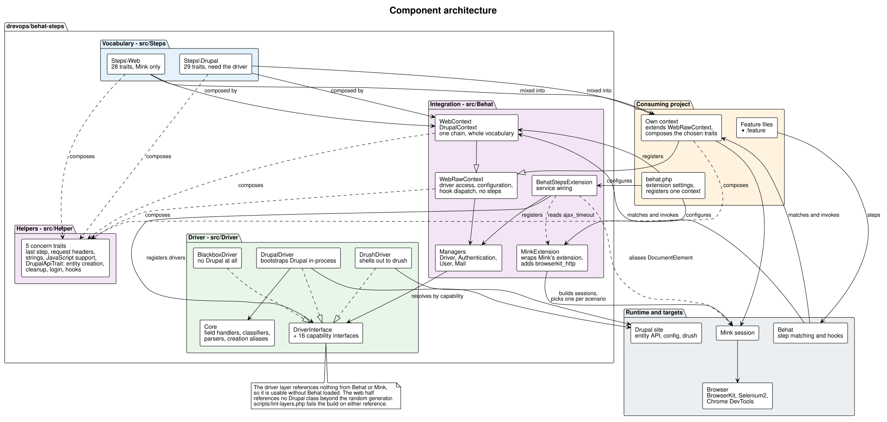
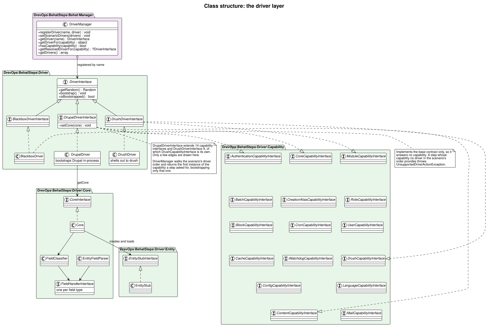
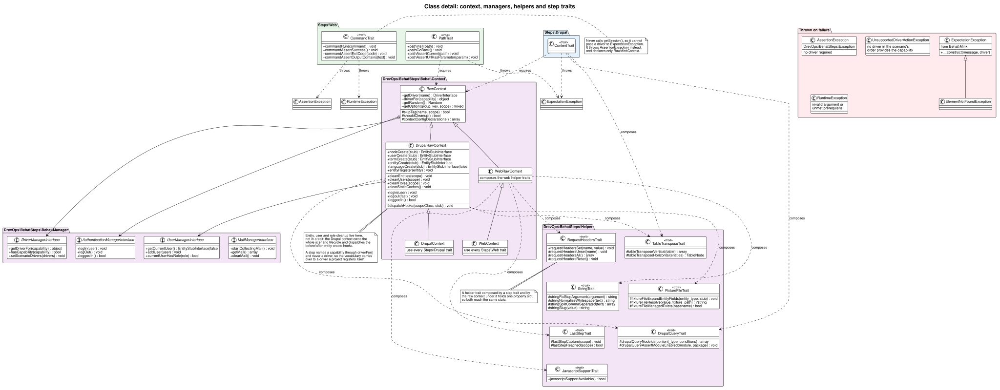
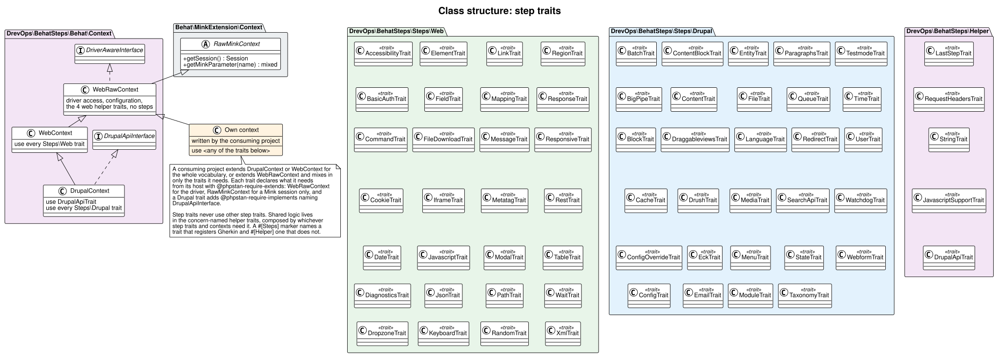
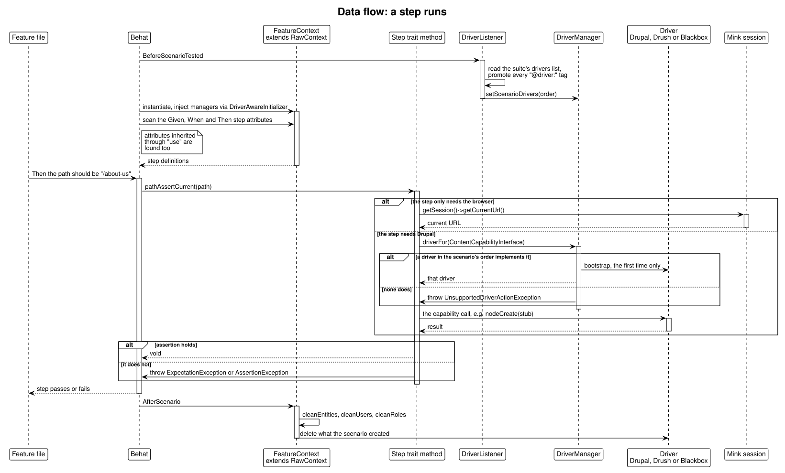
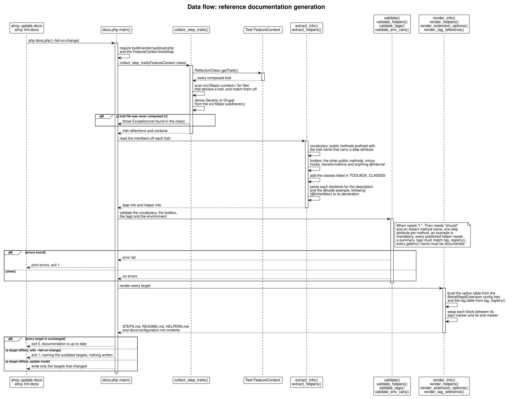
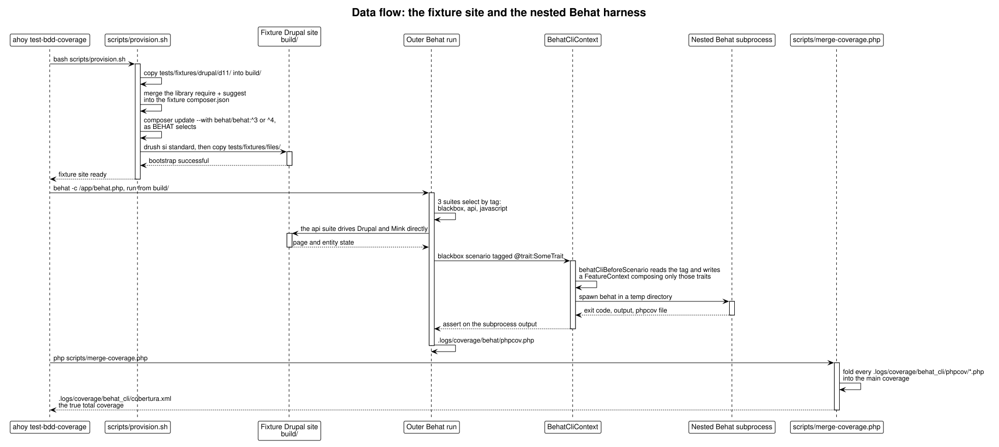

# Architecture

This is a walkthrough of how Behat Steps works: what the pieces are, and how a Gherkin step travels from a feature file to a browser or a Drupal API. Each section is traced from the sources it names, and the diagrams sit next to the prose that explains them.

This document and its diagrams are generated and maintained by an AI agent via the `update-architecture-docs` skill in [.claude/skills/update-architecture-docs/SKILL.md](../../.claude/skills/update-architecture-docs/SKILL.md). The content is derived from the source code. If this documentation and the code disagree, the code wins.

Looking for the list of steps instead? That's [STEPS.md](../../STEPS.md), and it's generated too.

## Diagram sources

Every diagram is a PlantUML source in this directory, rendered to a committed light `.svg`. Both are tracked, so a reviewer sees the source diff and the rendered result.

| Source | Renders | Shows |
| --- | --- | --- |
| `architecture.puml` | `architecture.svg` | The 3 library layers, the consuming project, and the runtime around them |
| `class-traits.puml` | `class-traits.svg` | Every step trait in both namespaces, and the context hierarchy they mix into |
| `class-context.puml` | `class-context.svg` | The context lifecycle, the managers, both helpers, representative step traits, and the exceptions a failing step throws |
| `class-drivers.puml` | `class-drivers.svg` | The Behat-free driver layer: the base contract, the capability interfaces, the 3 drivers, and the Core bridge |
| `dataflow-step.puml` | `dataflow-step.svg` | A step running in a consuming project |
| `dataflow-docs.puml` | `dataflow-docs.svg` | `docs.php` reflecting, validating and rendering `STEPS.md` |
| `dataflow-tests.puml` | `dataflow-tests.svg` | The fixture Drupal site, the nested Behat harness, and the coverage merge |

Regenerate every SVG after editing any source:

```bash
plantuml -tsvg docs/architecture/*.puml
```

PlantUML must be on the `PATH`. Install it with `brew install plantuml` on macOS or `apt-get install plantuml` on Debian and Ubuntu.

PlantUML is a Java application and needs a JRE or JDK 11 or later. macOS does not ship one, so check with `java -version` and install a JDK if that command is not found - the Homebrew formula pulls OpenJDK in as a dependency, which covers most setups. Class, component and activity diagrams also need Graphviz, which Homebrew pulls in the same way.

## Three layers

The library is no longer just a bag of traits. It's 3 layers, stacked, and the boundary between them is the most important thing to understand here.

**`src/Driver/` - the driver layer.** Talks to Drupal. Knows nothing about Behat.

**`src/Behat/` - the integration layer.** Wires the driver layer into a Behat suite: the extension, the service container, the managers, the context base class, the entity-creation hooks.

**`src/Steps/` - the vocabulary.** The step traits, split into `Steps\Generic` and `Steps\Drupal`. This is the only layer a consuming project mixes into its own `FeatureContext`.



The layering rule is enforced, not just documented. `scripts/lint-layers.php` reads every file under `src/Driver` and fails on any reference to the `Behat` or `Mink` root namespaces, and `ahoy lint` runs it alongside PHP_CodeSniffer, PHPStan, Rector and gherkinlint. So the driver layer stays usable without Behat loaded, and the check catches the first import that would break that rather than the tenth.

The dependency footprint reflects the shift. `composer.json` requires PHP 8.3+, Behat, Mink and the BrowserKit driver, plus `drupal/core-utility`, `friends-of-behat/mink-extension`, Guzzle, `webflo/drupal-finder`, and 5 Symfony components. This is a framework now, not a trait bag.

## The driver layer

A driver is the thing that actually talks to Drupal. `DriverInterface` is deliberately tiny - `getRandom()`, `bootstrap()`, `isBootstrapped()` - and everything else a driver can do is expressed as a separate capability interface in `Driver\Capability`: content, users, roles, config, modules, cache, cron, batch, language, mail, blocks, watchdog, authentication, creation aliases.

3 drivers implement different slices of that set. `DrupalDriver` bootstraps Drupal in-process and implements all 14. `DrushDriver` shells out and implements the 8 Drush can service. `BlackboxDriver` implements the base contract only, for testing a remote site with no Drupal access at all.



This is what makes a step's requirements explicit rather than implicit. A step that needs to create a node needs a driver implementing `ContentCapabilityInterface`; ask a driver that doesn't and you get `UnsupportedDriverActionException` naming the missing capability, instead of a fatal error somewhere deeper.

`DrupalDriver` delegates the messy part - turning a Gherkin table into a saved entity - to `Driver\Core`. That's where the field handlers live, one per field type (`DatetimeHandler`, `EntityReferenceHandler`, `ImageHandler`, `LinkHandler`, `AddressHandler` and a couple of dozen more), along with the classifiers that pick a handler and the parser that walks a stub's fields. `Driver\Alias` resolves human-friendly values into real ones: an author name into a uid, a parent term name into a tid, a vocabulary label into a machine name.

## The integration layer

`BehatStepsExtension` is a Behat extension registered under the `behat_steps` config key, and it replaces the Drupal Extension entirely. It loads the service definitions, registers the drivers named in `behat.yml`, picks the default driver, and wires the managers. The library also ships its own `MinkExtension` fork so it can alias its `DocumentElement` in and set the AJAX timeout.

`RawContext` is the base class a consuming `FeatureContext` extends. It registers no step definitions of its own - it owns the scenario lifecycle:

- Entity creation (`nodeCreate`, `userCreate`, `termCreate`, `entityCreate`, `languageCreate`), each dispatching before/after hooks so a project can adjust a stub in flight.
- Cleanup: `cleanEntities`, `cleanUsers` and `cleanRoles` run after the scenario and delete what it created, in reverse.
- Authentication: `login`, `logout`, `loggedIn`, delegated to `AuthenticationManager`.
- Driver access: `getDriver()`, and `assertDrupal()` for the steps that need the real thing.

Note where cleanup lives now. It is the context's job, not a trait's - which is why a project gets it by extending `RawContext` rather than by remembering to mix a trait in.



## The step vocabulary

Traits live in 2 places, and the split is meaningful:

- `src/Steps/Generic/` in `DrevOps\BehatSteps\Steps\Generic` - 29 traits that talk to Mink and know nothing about Drupal. `PathTrait`, `ElementTrait`, `JsonTrait`, `RegionTrait`, `CommandTrait` and friends.
- `src/Steps/Drupal/` in `DrevOps\BehatSteps\Steps\Drupal` - 30 traits that go through the driver. `ContentTrait`, `UserTrait`, `MediaTrait`, `DrushTrait`, `WatchdogTrait`, and so on.

That directory split isn't just tidiness. `docs.php` reads a trait's context straight off its subdirectory under `src/Steps`, so a file's location decides which index it lands in. The driver layer under `src/Driver/` is library code, not vocabulary, and is not scanned.

Each trait carries its steps as PHP attributes - `#[Given]`, `#[When]`, `#[Then]` from `Behat\Step\*` - sitting directly on the method that implements them. There's no `.yml` mapping and no separate registration step. The docblock above the method isn't decoration either: `docs.php` parses it, and the `@code` example inside it is mandatory.

Every trait declares what it needs from its host with `@phpstan-require-extends`: 34 name `RawContext` because they reach for the driver, and 18 name Mink's `RawMinkContext` because a session is all they touch. Mix a trait into a class without that ancestry and PHPStan says so before a test ever runs.



Step traits never `use` other step traits. Shared logic goes in the step-free `HelperTrait` in each namespace - table transposition, whitespace normalisation, request headers, fixture-file resolution - and nowhere else.

## Flow 1: a step runs

Nothing in this library is invoked directly. Behat owns the loop, and the traits are just where the matching methods happen to live.

When Behat starts, it instantiates the consuming project's `FeatureContext`, injects the managers through `DriverAwareInitializer`, and scans the class for step attributes - including every attribute inherited through a `use` statement. Matching a Gherkin line to a method is then ordinary Behat behaviour. The trait method runs with `$this` bound to the context, so `$this->getSession()` reaches Mink and `$this->getDriver()` reaches whichever driver the suite configured.



Assertions fail by throwing, and which exception is part of the public contract:

- A trait with a Mink session throws `ExpectationException`, passing the driver as the second argument so the message carries page context. A missing element throws `ElementNotFoundException`.
- A trait with no Mink session - `CommandTrait`, `Drupal\ConfigTrait`, `ModuleTrait`, `StateTrait`, `RedirectTrait` - throws `DrevOps\BehatSteps\Exception\AssertionException`, which needs no driver.
- A bad step argument or unmet prerequisite is not an assertion failure and throws `\RuntimeException`.
- A capability the active driver lacks throws `UnsupportedDriverActionException`.

Every lifecycle hook can be switched off from a feature file. Tag a scenario `@behat-steps-skip:JavascriptTrait` to opt a whole trait out, or `@behat-steps-skip:fileDownloadBeforeScenario` to disable a single hook. Entity cleanup honours the same convention, plus `@behat-steps-entity-cleanup-skip:<entity_type>` for leaving one type in place.

## Flow 2: the step documentation generates itself

`STEPS.md` is entirely generated, and `docs.php` is what generates it. It's a plain procedural script - top-level functions, no classes - and it runs against the fixture site's autoloader because it needs to reflect over real Drupal-dependent traits.

The trick is that it doesn't scan the filesystem for step definitions. It reflects over the test suite's own `FeatureContext`, which composes every trait in the library. That makes composition the source of truth: a trait file that exists but was never added to `FeatureContext` throws rather than being quietly skipped.



The validation half matters more than the rendering half. It's where the project's step-writing conventions stop being a style guide and start being enforced: a `@When` step without `I `, a `@Then` step whose method name lacks `Assert`, a method with 2 step attributes, a step with no `@code` example - each is a hard error. `tag_registry()` does the same job for tags, guarding against separator drift so that `@module:views` never quietly becomes `@module-views`.

Run with `--fail-on-change` (that's `ahoy lint-docs`), the script regenerates the blocks in memory and exits non-zero if they don't match what's committed, writing nothing. So the documentation can't drift, because a drifted build is a red build.

## Flow 3: how the library tests itself

This is the interesting part, and it's genuinely a bit unusual. A library of Drupal test steps can't be tested without a Drupal site, so the repository builds one - and then, for the failure paths, runs Behat inside Behat.

### Building the fixture site

`scripts/provision.sh` creates a throwaway Drupal site under `build/`. It copies the fixture from `tests/behat/fixtures_drupal/d11/`, then merges the library's own Composer requirements into that fixture's `composer.json` - including every package named in `suggest`, because the fixture site has to exercise all the traits at once. It installs Drupal with `drush si standard`, appends a couple of `$config` overrides to `settings.php` so `ConfigOverrideTrait` has something real to read, copies `tests/behat/fixtures/` into the site's files directory, and confirms the site bootstraps before handing back.

Behat then runs from inside `build/` but with the project-root `behat.yml`, which is why several paths in the config look one level off.

### The suite

`behat.yml` wires up `FeatureContext` (all the library traits plus test-only overrides), `BehatCliContext` (the nested runner), Mink's own `MinkContext`, the screenshot extension, and a PHP built-in server that serves `tests/behat/fixtures/` on port 8888 for the traits that need a static file and no Drupal at all. The `behat_steps` block configures `api_driver: drupal`, the Drush root and global options, the message selectors, the named regions, and the path mappings.

Default sessions run through BrowserKit. `@javascript` scenarios run through Selenium2, or through headless Chrome over the DevTools Protocol if you use the `chrome_headless` profile - which inherits everything and swaps only the JavaScript session, so the same suite proves the steps are driver-portable.

### Behat inside Behat

Asserting that a step *fails correctly* is awkward from inside the same run: the failure would fail your own scenario. So scenarios tagged `@trait:SomeTrait` take a detour.

`BehatCliTrait::behatCliBeforeScenario` reads the trait names out of the tag, writes a minimal `FeatureContext` composing just those traits into a temporary directory, and `BehatCliContext` runs a real `behat` subprocess against it. The outer scenario then asserts on the subprocess's exit code and output. One quirk worth knowing: nested PyStrings are written with `'''` and converted to `"""` on the way out, because you can't nest `"""` inside `"""` in Gherkin.



### Coverage, and the file everyone reads wrong

Because half the failure paths are only ever exercised inside subprocesses, coverage arrives in 2 pieces and has to be stitched together.

The outer run writes `.logs/coverage/behat/`. Each nested subprocess drops its own file into `.logs/coverage/behat_cli/phpcov/`. `scripts/merge-coverage.php` folds them together and writes the merged report to `.logs/coverage/behat_cli/cobertura.xml`.

That merged file is the real number. The `behat/` one only ever shows the direct scenarios, so it reads lower - which is exactly the kind of thing that sends someone off chasing coverage that already exists. `scripts/check-coverage.php` defaults to the merged file for that reason.

Alongside all this, `tests/phpunit/` holds ordinary unit tests for the parts that don't need a browser: `docs.php` itself, the driver layer, and the pure helper logic in the traits.

## Continuous integration

`.github/workflows/test.yml` has 2 jobs, both running inside the project's own Docker Compose stack so CI and local development execute the same commands.

`lint` provisions the fixture site and runs `ahoy lint` - PHP_CodeSniffer, PHPStan, Rector in dry-run mode, gherkinlint over the feature files, and `scripts/lint-layers.php` for the driver-layer boundary - followed by `ahoy lint-docs`, which is the `docs.php --fail-on-change` gate.

`test` is a matrix of PHP 8.3, 8.4 and 8.5 against Drupal 11, each run twice - once with `normal` dependency resolution and once with `lowest` - plus 1 extra leg that runs the whole suite through the Selenium-less `chrome_headless` driver. Unit and BDD tests run on every leg. Coverage is collected on the PHP 8.3 / normal leg and uploaded to Codecov. Test artifacts - logs, screenshots, coverage - come back from every leg, passing or failing.

## Regenerating this document

After a structural change - a new layer or namespace, a change to how `RawContext` composes the lifecycle, a new driver or capability, a change to how `docs.php` discovers steps, a change to the fixture harness or the CI matrix - ask the AI agent to "update architecture docs". It re-traces the affected diagrams and prose from the current code via the `update-architecture-docs` skill, and re-renders the SVGs in the same pass.
