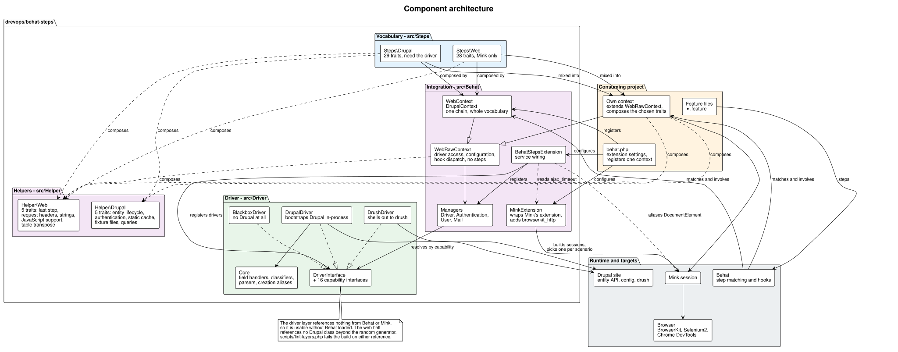
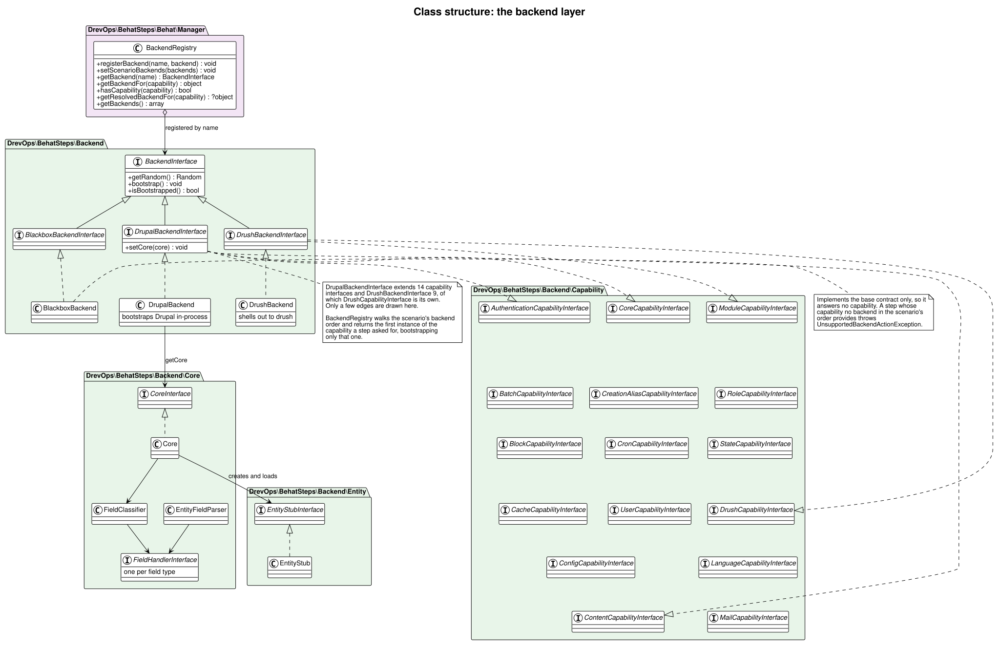
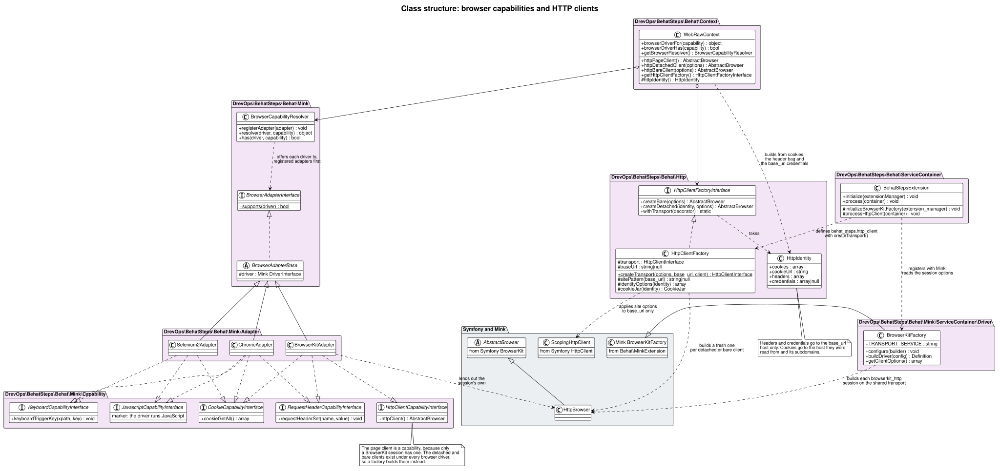
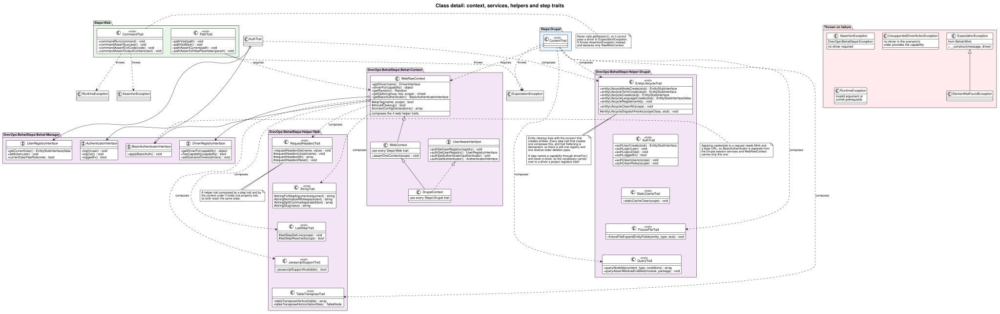
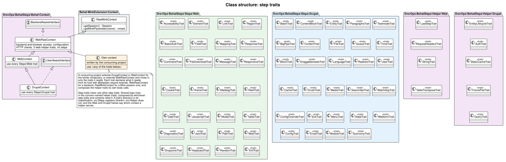
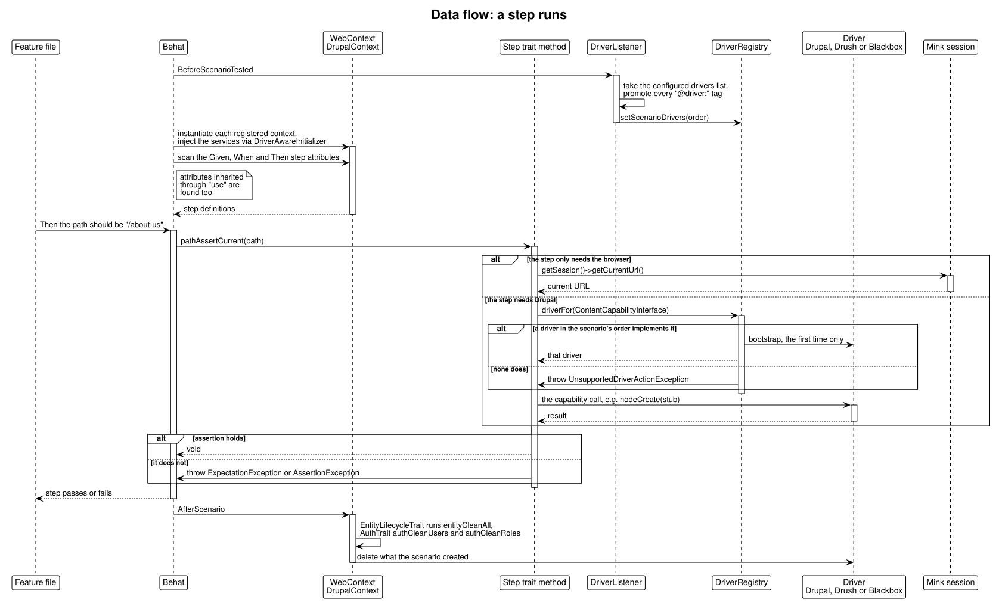
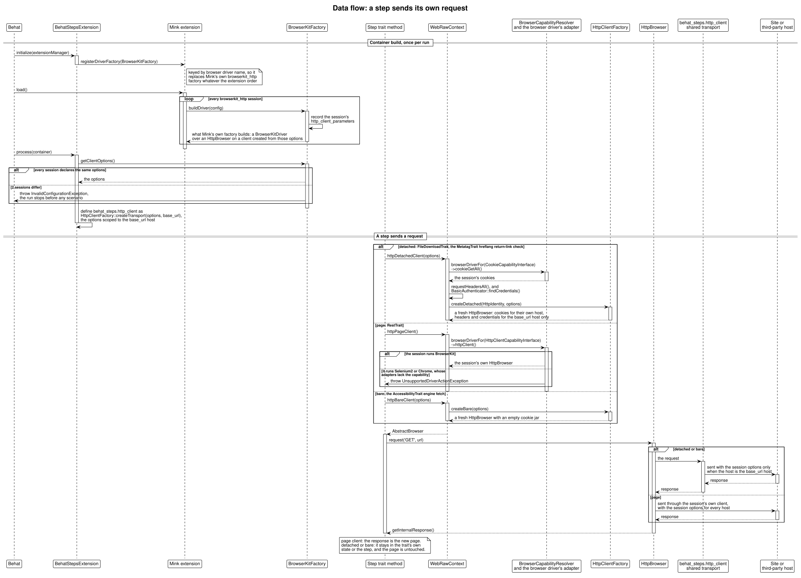
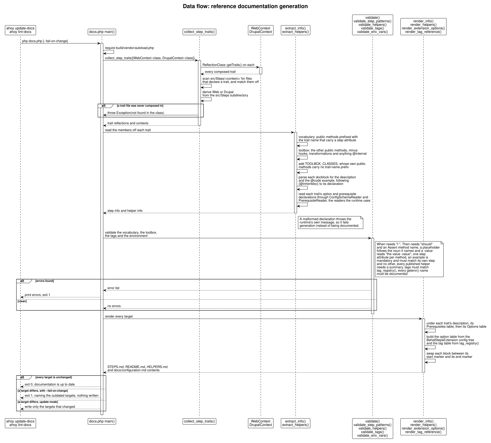
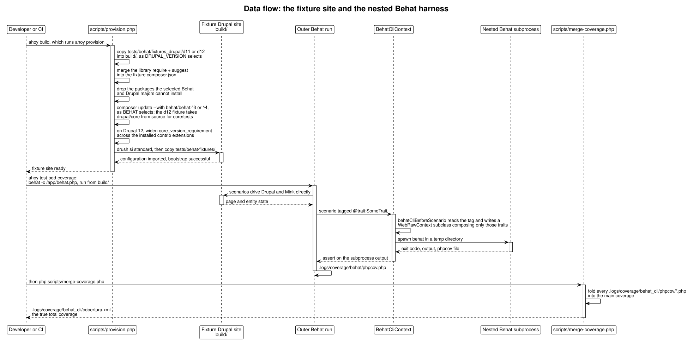

# Architecture

This is a walkthrough of how Behat Steps works: what the pieces are, and how a Gherkin step travels from a feature file to a browser or a Drupal API. Each section is traced from the sources it names, and the diagrams sit next to the prose that explains them.

This document and its diagrams are generated and maintained by an AI agent via the `update-architecture-docs` skill in [.claude/skills/update-architecture-docs/SKILL.md](../../.claude/skills/update-architecture-docs/SKILL.md). The content is derived from the source code. If this documentation and the code disagree, the code wins.

Looking for a reference instead? [STEPS.md](../../STEPS.md) lists the steps, [HELPERS.md](../../HELPERS.md) lists the toolbox behind them, and [docs/configuration.md](../configuration.md) lists the options and tags. All three are generated.

## Diagram sources

Every diagram is a PlantUML source in this directory, rendered to a committed light `.svg`. Both are tracked, so a reviewer sees the source diff and the rendered result.

| Source | Renders | Shows |
| --- | --- | --- |
| `architecture.puml` | `architecture.svg` | The 3 library layers, the consuming project, and the runtime around them |
| `class-traits.puml` | `class-traits.svg` | Every step trait in both namespaces, and the context hierarchy they mix into |
| `class-context.puml` | `class-context.svg` | The context hierarchy, its services and prerequisite declarations, the helper traits, representative step traits, and the exceptions a failing step throws |
| `class-backends.puml` | `class-backends.svg` | The Behat-free backend layer: the base contract, the capability interfaces, the 3 backends, and the Core bridge |
| `class-browser.puml` | `class-browser.svg` | The browser capability layer, the HTTP client factory, and the `browserkit_http` browser driver factory |
| `dataflow-step.puml` | `dataflow-step.svg` | A step running in a consuming project |
| `dataflow-http.puml` | `dataflow-http.svg` | A step sending its own request through the page, detached or bare client |
| `dataflow-docs.puml` | `dataflow-docs.svg` | `docs.php` reflecting, validating and rendering every reference document |
| `dataflow-tests.puml` | `dataflow-tests.svg` | The fixture Drupal site, the nested Behat harness, and the coverage merge |

Regenerate every SVG after editing any source:

```bash
plantuml -tsvg docs/architecture/*.puml
```

PlantUML must be on the `PATH`. Install it with `brew install plantuml` on macOS or `apt-get install plantuml` on Debian and Ubuntu.

PlantUML is a Java application and needs a JRE or JDK 11 or later. macOS does not ship one, so check with `java -version` and install a JDK if that command is not found - the Homebrew formula pulls OpenJDK in as a dependency, which covers most setups. Class, component and activity diagrams also need Graphviz, which Homebrew pulls in the same way.

## Three layers

The library is no longer just a bag of traits. It's 3 layers, stacked, and the boundary between them is the most important thing to understand here.

**`src/Backend/` - the backend layer.** Talks to Drupal. Knows nothing about Behat.

**`src/Behat/` - the integration layer.** Wires the backend layer into a Behat suite: the extension, the service container, the backend, user and scenario tag registries, the authenticators, the 3 context classes, option resolution, trait prerequisites, the entity-creation hooks, the browser capabilities, and the HTTP clients a step sends its own requests through.

**`src/Helper/` - the shared internals.** 9 step-free traits, each named for one concern, composed by whichever step traits and contexts need them. It splits the same way the vocabulary does: `Helper\Web` names nothing Drupal and serves `WebContext`, `Helper\Drupal` reaches a backend and serves `DrupalContext`.

**`src/Steps/` - the vocabulary.** The step traits, split into `Steps\Web` and `Steps\Drupal`. This is the layer a consuming project registers, or mixes into a context of its own.



The layering rule is enforced, not just documented. `scripts/lint-layers.php` declares 2 layers and the namespaces each one excludes: `src/Backend` may not reference `Behat` or `Mink`, and `src/Steps/Web` with `WebRawContext`, `WebContext` and every trait under `src/Helper/Web` may not reference `Drupal` beyond `Drupal\Component\Utility\Random`. `ahoy lint` runs it alongside PHP_CodeSniffer, PHPStan, Rector, gherkinlint and `scripts/lint-traits.php`, which holds a step trait to composing no other step trait and a helper trait to registering no Gherkin. So the backend layer stays usable without Behat loaded and the web half without Drupal, and the check catches the first import that would break either rather than the tenth.

The dependency footprint reflects the shift. `composer.json` requires PHP 8.3+, Behat 3.33 or 4, Mink and the BrowserKit driver, plus `drupal/core-utility`, `friends-of-behat/mink-extension`, and 8 Symfony components, BrowserKit, HttpClient and Mime among them for the requests steps send themselves. This is a framework now, not a trait bag.

## The backend layer

A backend is the thing that actually talks to Drupal. `BackendInterface` is deliberately tiny - `getRandom()`, `bootstrap()`, `isBootstrapped()` - and everything else a backend can do is expressed as a separate capability interface in `Backend\Capability`: content, users, roles, config, modules, state, cache, cron, batch, language, mail, blocks, authentication, creation aliases, Drupal's API in this process, and Drush commands.

3 backends implement different slices of that set. `DrupalBackend` bootstraps Drupal in-process and implements 15 of the 16, every one but Drush commands. `DrushBackend` shells out and implements the 10 Drush can service, Drush commands included. `BlackboxBackend` implements the base contract only, for testing a remote site with no Drupal access at all.



This is what makes a step's requirements explicit rather than implicit, and it is also how a backend is chosen. A step names the capability it needs - a step that creates a node asks for `ContentCapabilityInterface` - and `BackendRegistry` walks the scenario's backend order and hands back the first backend implementing it, bootstrapping only that one. When none does, the step fails with `UnsupportedBackendActionException` naming the capability and the order, instead of a fatal error somewhere deeper.

The order itself comes from the extension configuration: its `backends` list is both the allow-list and the precedence order, and a `@backend:NAME` tag moves one of those names to the front for a single scenario or feature. A step never names a backend, so the shipped vocabulary carries over unchanged to a backend a project registers itself.

`DrupalBackend` delegates the messy part - turning a Gherkin table into a saved entity - to `Backend\Core`. That's where the field handlers live, one per field type (`DatetimeHandler`, `EntityReferenceHandler`, `ImageHandler`, `LinkHandler`, `AddressHandler` and a couple of dozen more), along with the classifiers that pick a handler and the parser that walks a stub's fields. `Backend\Alias` resolves human-friendly values into real ones: an author name into a uid, a parent term name into a tid, a vocabulary label into a machine name.

## The integration layer

`BehatStepsExtension` is a Behat extension registered under the `behat_steps` config key, and it replaces the Drupal Extension entirely. It loads the service definitions, registers the backends named in the Behat configuration, validates the `backends` list against those registrations, wires the services, defines the shared HTTP transport, and aliases the library's `DocumentElement` over Mink's own.

`BackendListener` builds the backend order once per scenario, before the first step: it takes the configured `backends` list, moves every `@backend:` name to the front, and hands the result to `BackendRegistry`. A tag naming a backend the list does not hold fails there, at scenario start, so a typo cannot quietly run the wrong backend. A `@driver:` tag fails there too, naming the `@backend:` tag to use instead. It publishes the scenario's tags to `ScenarioTagRegistry` in the same pass, which Behat dispatches before the first `BeforeScenario` hook, so a tag that sets a trait option reaches a step as well as a hook. Both registries live in `Behat\Registry`, beside `UserRegistry`, which keeps the users a scenario created and the one logged in.

`SkipTagListener` runs on the same event, just before it. A `@behat-steps-skip:` tag has to name a trait, because a hook reads it by its trait's name alone, so a tag carrying a hook method name or any other value would switch nothing off. The listener fails the run there instead, naming the tag.

`Behat\Config` holds option resolution, which `WebRawContext` delegates to rather than carrying. `ConfigSchemaReader` is the only piece that reflects: it walks a context class for `<prefix>ConfigSchema()` methods and returns the `Option` objects they declare, cached per class. `TraitOptionResolver` layers the declaration defaults, the extension's `steps` section and the context's `config` argument, and exposes a typed read per declared type. `TagOverrides` applies the tags an option declares, plus the `@behat-steps-skip:<Trait>` tag every `enabled` option carries, and holds the pattern a skip tag's value has to match. A resolver depends on the context class that declared the options and on the `config` argument that context was given, so `TraitOptionResolverFactory` builds one per context; registering another factory under `behat_steps.config.resolver_factory` replaces resolution everywhere at once.

`Behat\Prerequisite` holds what a trait needs from the site, which is a separate question from whether the trait is switched on. `Prerequisite` is 1 declaration: a capability interface, an optional static closure that takes a backend providing it and returns whether the prerequisite holds, and a description that both the failure message and `STEPS.md` quote. A trait returns its declarations from `<prefix>Prerequisites()`, named like its `<prefix>ConfigSchema()`, and `PrerequisiteReader` calls that method once per context class and trait for the run, since a context can redeclare it. It caches the declarations but never an answer, because a tag, a step or an out-of-process command can install or uninstall a module at any time.

Browser sessions come from Mink's own extension, which the suite registers alongside this one. `BehatStepsExtension::initialize()` hands it a `BrowserKitFactory`, and Mink keys its browser driver factories by name, so that factory replaces Mink's own for `browserkit_http`. Behat calls `initialize()` once every extension is activated and before it builds any configuration tree, so the swap holds whichever order the suite lists the 2 extensions - it's the same hook the Chrome extension uses to add its browser driver.

The factory keeps Mink's configuration tree and builds each session exactly as Mink does: an `HttpBrowser` on a client of its own, carrying the session's `http_client_parameters` for every host. It adds 1 thing, which is recording those options. `BehatStepsExtension::process()` turns them into 1 transport service, `behat_steps.http_client`, once Mink has built every session, through `HttpClientFactory::createTransport()`, with the options scoped to the `base_url` host. The detached and bare clients send through that transport. Sessions that declare different options stop the run there, because the transport carries 1 set.

The browser half resolves by capability, the same way the backend half does. `Behat\Mink\Capability` holds 5 interfaces - cookies, the page's HTTP client, JavaScript, the keyboard and request headers - and `Behat\Mink\Adapter` holds 1 adapter per shipped browser driver family, because a browser driver comes from another package and can't implement them itself. `BrowserCapabilityResolver` offers the session's browser driver to each adapter in turn, registered adapters first. `WebRawContext::browserDriverFor()` returns the adapter that answers, or throws `UnsupportedDriverActionException` naming the capability.

Requests a step sends itself go through `Behat\Http`. `WebRawContext` hands out 3 clients, and all 3 are BrowserKit browsers. `httpPageClient()` resolves the session's own `HttpBrowser` through the HTTP client capability, so its response becomes the page. `httpDetachedClient()` and `httpBareClient()` come from `HttpClientFactoryInterface`, the `behat_steps.http_client_factory` service, which builds a fresh `HttpBrowser` on the shared transport each time, with any options the caller passes taking precedence over the session's. The detached one carries an `HttpIdentity` - the session's cookies, the request header bag and the `base_url` credentials - and sends its headers and credentials to the `base_url` host only. [HTTP clients](../http-clients.md) tells the same story from the consuming project's side.



The context layer is one chain. `WebRawContext` is the root and registers no steps:

- Backend access: `backendFor()`, which resolves the capability a step names, and `getBackend()` for the rare caller that wants one suite backend by name.
- Option resolution: `getOptionBool()`, `getOptionInt()`, `getOptionFloat()`, `getOptionString()` and `getOptionArray()` each read a trait's option at the type its declaration defaults to, through the declaration default, the extension's `steps` section, the context's `config` argument and the scenario's tags. `getOption()` covers a declaration that defaults to `NULL` and so names no type.
- Basic authentication: `getBasicAuthenticator()`, because `BasicAuthTrait` is a web trait and calls it.
- Browser access: `browserDriverFor()` and `browserDriverHas()`, which resolve a browser capability.
- HTTP clients: `httpPageClient()`, `httpDetachedClient()` and `httpBareClient()`.
- Prerequisite checks: `assertPrerequisites()` throws for the first declaration that doesn't hold, naming it and, for a trait with an `enabled` option, the option and the skip tag that switch the trait off. `prerequisitesMet()` answers the same question without throwing, for a teardown. Each check goes through `anyBackendFor()`, which returns a backend the scenario already reached before the first one listed, so checking never starts a second backend. A trait adapting to an optional module asks through it too.
- The hook dispatcher and `skipTag()`.
- 3 of the web helper traits: `LastStepTrait`, `RequestHeadersTrait` and `StringTrait`.

`WebContext` extends it and composes every trait under `src/Steps/Web`. `DrupalContext` extends `WebContext` and composes every trait under `src/Steps/Drupal`. The Drupal scenario lifecycle does not sit on the context: each step trait composes the helper traits it needs, so the lifecycle arrives with the traits that use it:

- Entity creation (`entityLifecycleCreateNode`, `authCreateUser`, `entityLifecycleCreateTerm`, `entityLifecycleCreate`, `entityLifecycleCreateLanguage`), each dispatching before/after hooks so a project can adjust a stub in flight.
- Cleanup: `entityLifecycleAfterScenario` deletes what the scenario created, in reverse, and `authAfterScenario` deletes its users and then its roles, running the role cleanup even when deleting the users fails.
- Authentication: `authLogin`, `authLogout`, `authIsLoggedIn`, delegated to `Authenticator`.

Every helper member carries its trait's prefix, so two helpers mixed into one context cannot collide and a reader can tell from a call site which trait has to be composed.

Note where cleanup lives. It is the lifecycle trait's job, not a step trait's, so it arrives with whichever step traits create the thing being torn down. A suite that extends `WebContext`, or composes no entity-creating trait, never runs those hooks at all.

Authentication splits along the same line, with both halves in `Behat\Auth`. `Authenticator` holds a Drupal session and lives behind `UserAwareInterface`, which `DrupalContext` declares; `BasicAuthenticator` needs only Mink and a base URL, so `WebRawContext` carries it through `getBasicAuthenticator()` and a suite with no Drupal site still gets basic auth.

A consumer extends exactly one class, and registering two of them is fatal: `DrupalContext` inherits `WebContext`'s 28 traits, so both registered would register every web step twice. `WebContext::assertOneContext()` runs on `BeforeSuite` and names that rather than letting Behat report a `RedundantStepException` about an arbitrary step. `ContextCompositionTest` holds the directory-to-context coverage in both directions and holds the chain to one composition of each trait.



## The step vocabulary

Traits live in 2 places, and the split is meaningful:

- `src/Steps/Web/` in `DrevOps\BehatSteps\Steps\Web` - 28 traits that talk to Mink and know nothing about Drupal. `PathTrait`, `ElementTrait`, `JsonTrait`, `RegionTrait`, `CommandTrait` and friends.
- `src/Steps/Drupal/` in `DrevOps\BehatSteps\Steps\Drupal` - 29 traits that go through a backend. `ContentTrait`, `UserTrait`, `MediaTrait`, `DrushTrait`, `WatchdogTrait`, and so on.

That directory split isn't just tidiness. `docs.php` reads a trait's context straight off its subdirectory under `src/Steps`, so a file's location decides which index it lands in, and it also decides which shipped context has to compose the trait. The backend layer under `src/Backend/` and the helper traits under `src/Helper/Web/` and `src/Helper/Drupal/` are library code, not vocabulary, and are documented in `HELPERS.md` instead.

Each trait carries its steps as PHP attributes - `#[Given]`, `#[When]`, `#[Then]` from `Behat\Step\*` - sitting directly on the method that implements them. There's no `.yml` mapping and no separate registration step. The docblock above the method isn't decoration either: `docs.php` parses it, and the `@code` example inside it is mandatory.

Every trait declares what it needs from its host with `@phpstan-require-extends`: 49 name `WebRawContext` because they reach for a backend, the extension configuration, a browser capability or an HTTP client, and 8 name Mink's `RawMinkContext` because a session is all they touch. A step trait also composes the helper traits its body calls, and `ContextCompositionTest` fails one that calls a helper member it has not composed. Mix a trait into a class without that ancestry and PHPStan says so before a test ever runs. The `BareMinkContext` fixture composes the 7 web ones into a bare `RawMinkContext` subclass, and `ContextCompositionTest` holds it against the annotations, so a requirement that tightens is caught.



Step traits never `use` other step traits. Shared logic goes in a trait under `src/Helper/` named for its concern - last-step tracking, the request header bag, string shaping and step argument parsing, table transposition, and the whole Drupal scenario lifecycle - and nowhere else. A trait's directory is its classification: `src/Steps` registers Gherkin, `src/Helper` registers none, and `scripts/lint-traits.php` makes that a lint rather than a convention. A helper trait composed by a step trait and by the context under it holds one property slot, so both reach the same state.

## Flow 1: a step runs

Nothing in this library is invoked directly. Behat owns the loop, and the traits are just where the matching methods happen to live.

When Behat starts, it instantiates every registered context, injects those services through `BackendAwareInitializer`, and scans each class for step attributes - including every attribute inherited through a `use` statement. Matching a Gherkin line to a method is then ordinary Behat behaviour. The trait method runs with `$this` bound to the context, so `$this->getSession()` reaches Mink and `$this->backendFor()` reaches the first backend in the scenario's order that provides the capability the step names.

Because a step attribute is inherited through `use`, two registered contexts composing the same trait register its steps twice and Behat fails with a `RedundantStepException`. That is why each class in the chain composes a trait the ones above it do not, and why a project that hand-composes a trait registers its own context instead of the shipped one that already carries it.



Assertions fail by throwing, and which exception is part of the public contract:

- A trait with a Mink session throws `ExpectationException`, passing the browser driver as the second argument so the message carries page context. A missing element throws `ElementNotFoundException`.
- A trait with no Mink session - `CommandTrait`, `Drupal\ConfigTrait`, `ModuleTrait`, `StateTrait`, `RedirectTrait` - throws `DrevOps\BehatSteps\Exception\AssertionException`, which needs no browser driver.
- A bad step argument or unmet prerequisite is not an assertion failure and throws `\RuntimeException`.
- A capability the session's browser driver lacks throws Mink's `UnsupportedDriverActionException`. A capability no backend in the scenario's order provides throws the backend layer's own `UnsupportedBackendActionException`.

A trait's hooks can be switched off from a feature file. `@behat-steps-skip:JavascriptTrait` on a scenario or a feature switches off every hook `JavascriptTrait` registers: each scenario hook opens with `skipTag(__TRAIT__, $scope)`, which reads the tag together with the trait's `enabled` option, and a step hook reads a flag its trait's `BeforeScenario` hook set behind that guard. A scenario hook that only resets its trait's own state has nothing to switch off and carries no guard; `SkipGuardTest` lists each one with the reason, and fails a new hook that is neither guarded nor listed. Entity cleanup honours the same convention through `@behat-steps-skip:EntityLifecycleTrait`, plus `@behat-steps-entity-cleanup-skip:<entity_type>` for leaving one type in place.

Switching a trait off and failing on its prerequisites stay separate. A setup hook returns on `skipTag()` first, so an opted-out trait asks nothing of any backend, and only then calls `assertPrerequisites()`, so an opted-in trait whose prerequisites don't hold fails the scenario at its start and its steps are skipped. `WatchdogTrait` is the case in the diagram above: it needs `CoreCapabilityInterface` and the `dblog` module, so a profile listing only `drush` and `blackbox` fails at scenario start unless the trait is switched off. A step checks its trait's prerequisites as it runs, so a suite that never runs a webform step never needs `webform`, and a teardown asks `prerequisitesMet()` instead, so it can't replace a failure the scenario already recorded.

Every one of those tags is read through `Tag`, which strips the leading `@` first. Behat 3 removes it by default and Behat 4 keeps it, so going through `Tag` is what lets the same tag match on both.

## Flow 2: a step sends its own request

Most steps read the page the Mink session holds. A few send a request of their own from PHP - a file download, the hreflang return-link check, the accessibility engine fetch, a REST call - and each one goes through 1 of the 3 clients. The method a trait calls names which.

The transport comes first, and it's built once per run. Mink calls `BrowserKitFactory::buildDriver()` for every `browserkit_http` session it's configured with. The factory records the session's options and returns what Mink's own factory returns: a `BrowserKitDriver` over an `HttpBrowser` on a client created from those options, which applies them to every host. `BehatStepsExtension::process()` then defines `behat_steps.http_client` from the recorded options, scoped to the `base_url` host, and the detached and bare clients send through it. So a certificate setting that lets the page load also lets a download through.

Then a step asks for a client. `FileDownloadTrait` asks for the detached one: `WebRawContext` reads the session's cookies through the cookie capability, which all 3 adapters provide, adds the request header bag and the `base_url` credentials, and hands that `HttpIdentity` to the factory. The response lands in the trait's own state, so the next page assertion still reads the page. `RestTrait` asks for the page client instead, and only a BrowserKit session has one, so under Selenium2 or Chrome the step throws. `AccessibilityTrait` asks for the bare client, which carries nothing of the scenario and reaches the CDN with Symfony's defaults, since the transport applies the session options to the `base_url` host only.



Under `@javascript` the detached and bare clients work the same way, as a sidecar. The browser holds the page, and the client sends from PHP next to it, taking its settings from `http_client_parameters` rather than from the browser's capabilities. So a suite whose sessions are all JavaScript still declares a `browserkit_http` session when those requests need options of their own.

## Flow 3: the reference documentation generates itself

Every reference document is generated, and `docs.php` is the only thing that generates them. It's a plain procedural script - top-level functions, no classes - and it runs against the fixture site's autoloader because it needs to reflect over real Drupal-dependent traits.

One run writes 4 targets: `STEPS.md` and the step index in `README.md`, `HELPERS.md`, and the option and tag tables in `docs/configuration.md`. Each lands in a marked block of its file, and only the targets whose block actually changed are written.

The trick is that it doesn't scan the filesystem for step definitions. It reflects over `WebContext` and `DrupalContext`, which between them compose every trait in the library. That makes composition the source of truth, and it documents exactly what a project gets by registering them: a trait file that exists but was never added to its context throws rather than being quietly skipped.

The same reflection pass yields both halves of the package, and visibility is what separates them. A public method carrying a `Behat\Step\*` attribute is vocabulary and goes to `STEPS.md`; a public method carrying no Behat attribute at all is toolbox and goes to `HELPERS.md`, unless its docblock withdraws it with `@internal`. A protected method is an implementation detail and appears in neither. On a trait both halves are filtered by the trait-name prefix every member already carries, so a method borrowed from elsewhere is not published under a trait that merely composes it. `TOOLBOX_CLASSES` adds the 3 raw contexts to the toolbox half, because a project's own step definitions are written against their lifecycle methods as much as against a trait's helpers; a class is read without that prefix filter, since its methods carry no trait name.



The option and tag tables come from the code rather than from the reflection pass: the options are read off the config tree `BehatStepsExtension::configure()` builds, and the tags off `tag_registry()`. Neither can be added without appearing in the reference.

Each trait's entry in `STEPS.md` also carries a Prerequisites table and an Options table, below its description. `docs.php` reads both through `PrerequisiteReader` and `ConfigSchemaReader`, the readers the runtime uses, so a malformed declaration fails generation with the runtime's own message instead of being documented.

The validation half matters more than the rendering half. It's where the project's conventions stop being a style guide and start being enforced: a `@When` step without `I `, a `@Then` step whose method name lacks `Assert`, a placeholder placed before the noun it names, a `:value` that doesn't read `the value :value`, a method with 2 step attributes, a step with no `@code` example, a published helper with no summary, a `getenv()` name that `docs/configuration.md` never mentions - each is a hard error. `tag_registry()` does the same job for tags, guarding against separator drift so that `@module:views` never quietly becomes `@module-views`.

One of those checks is less obvious than the rest. `validate_step_patterns()` compiles every registered pattern through Behat's own `TurnipPatternPolicy` and runs each documented `@code` example past all of them. An example that matches 2 definitions is a hard error, and so is a step whose own example no longer matches it. That catches the failure Behat itself won't: a pattern like `I process all items from the queue :queue` also satisfies `I process :count item(s) from the queue :queue`, and Behat only notices when a scenario actually runs the shadowed step.

Run with `--fail-on-change` (that's `ahoy lint-docs`), the script regenerates the blocks in memory and exits non-zero if they don't match what's committed, naming the targets that drifted and writing nothing. So the documentation can't drift, because a drifted build is a red build.

## Flow 4: how the library tests itself

This is the interesting part, and it's genuinely a bit unusual. A library of Drupal test steps can't be tested without a Drupal site, so the repository builds one - and then, for the failure paths, runs Behat inside Behat.

### Building the fixture site

`scripts/provision.php` creates a throwaway Drupal site under `build/`. The `DRUPAL_VERSION` variable picks the core major, `11` unless set, and names the fixture directory it copies from - `tests/behat/fixtures_drupal/d11/` or `d12/`. It then merges the library's own Composer requirements into that fixture's `composer.json` - including every package named in `suggest`, because the fixture site has to exercise all the traits at once - dropping any package the fixture already pins, so the fixture's constraint is the one that survives. It installs Drupal with `drush si standard`, appends a couple of `$config` overrides to `settings.php` so `ConfigOverrideTrait` has something real to read, copies `tests/behat/fixtures/` into the site's files directory, and confirms the site bootstraps before handing back.

Between those last 2 it checks that the configuration import landed, by reading a config entity only the fixture defines. `drush cim` can enable the modules, abort on a fatal while it is creating config entities, and still exit 0, which leaves a site that boots and has none of the content types the suite asserts on.

The `BEHAT` variable picks the Behat major, `3` unless set. `composer.json` allows both Behat 3.33 and Behat 4, and `composer update --with="behat/behat:^${BEHAT}"` narrows the fixture to one. Each major combination then drops what it cannot install: a Behat 4 build removes `dmore/behat-chrome-extension`, and on Drupal 11 also `dvdoug/behat-code-coverage`.

Drupal 12 needs contrib relaxed at two layers, because no contrib release declares it yet. For the Composer solve, `d12/composer.json` lists every contrib module under `extra.drupal-lenient.allowed-list` for `mglaman/composer-drupal-lenient` to strip the core constraint from; a plugin only shapes a solve it is already installed for, so provisioning installs it globally first - Composer loads global plugins for local projects. For Drupal itself, which reads `core_version_requirement` from each extension and refuses to enable one that excludes the running major, provisioning appends `|| ^12` to that key across the contrib extensions in `build/`, leaving the fixture sources untouched.

The Drupal 12 fixture pins `~12.0.0-beta1`, and that release changed 2 more things the fixture works around. It moved Olivero, Claro and Search out of core, so `d12/composer.json` installs them from contrib under the same machine names. It also stopped shipping core's test files in the dist package, which the PHPUnit bootstrap, the Kernel suite and core's test modules need, so the fixture sets `preferred-install` to take `drupal/core` from source. Provisioning passes no `--prefer-dist`, because that flag would override the per-package setting.

Behat then runs from inside `build/` but with the project-root `behat.php`, which is why several paths in the config look one level off.

### The suite

`behat.php` wires up `FeatureContext` (`DrupalContext` plus the test-only steps and overrides), `BehatCliContext` (the nested runner), Mink's own `MinkContext`, the screenshot extension, and a PHP built-in server that serves `tests/behat/fixtures/` on port 8888 for the traits that need a static file and no Drupal at all. The `BehatStepsExtension` settings list the `drupal`, `drush` and `blackbox` backends, the Drush root and global options, the message selectors, the named regions, and the path mappings. The coverage extension is registered only when it is installed, so a Behat 4 build runs without it. Behat 4 reads only PHP configuration, and Behat 3.33 reads the same file.

Default sessions run through BrowserKit, on Mink's `HttpBrowser`. `@javascript` scenarios run through Selenium2, or through headless Chrome over the DevTools Protocol if you use the `chrome_headless` profile - which inherits everything and swaps only the JavaScript session, so the same suite proves the steps are portable across browser drivers.

### Behat inside Behat

Asserting that a step *fails correctly* is awkward from inside the same run: the failure would fail your own scenario. So scenarios tagged `@test-trait:SomeTrait` take a detour.

`BehatCliTrait::behatCliBeforeScenario` reads the trait names out of the tag, writes a minimal `WebRawContext` subclass composing just those traits into a temporary directory, and `BehatCliContext` runs a real `behat` subprocess against it. The generated context starts from the step-free root and composes `AuthTrait` and `StaticCacheTrait`, the two helpers no step trait body calls into, because a tag names a trait from either half. The outer scenario then asserts on the subprocess's exit code and output. The subprocess reads a `behat.php` that `BehatCliTrait` writes, and the generated context declares its steps and hooks as PHP attributes, because Behat 4 ignores docblock annotations. One quirk worth knowing: nested PyStrings are written with `'''` and converted to `"""` on the way out, because you can't nest `"""` inside `"""` in Gherkin.



### Coverage, and the file everyone reads wrong

Because half the failure paths are only ever exercised inside subprocesses, coverage arrives in 2 pieces and has to be stitched together.

The outer run writes `.logs/coverage/behat/`. Each nested subprocess drops its own file into `.logs/coverage/behat_cli/phpcov/`. `scripts/merge-coverage.php` folds them together and writes the merged report to `.logs/coverage/behat_cli/cobertura.xml`.

That merged file is the real number. The `behat/` one only ever shows the direct scenarios, so it reads lower - which is exactly the kind of thing that sends someone off chasing coverage that already exists. `scripts/check-coverage.php` defaults to the merged file for that reason.

Alongside all this, `tests/phpunit/` holds ordinary unit tests for the parts that don't need a browser: `docs.php` itself, the backend layer, the helper traits, and the convention tests at the root of `tests/phpunit/src/` that hold the naming, member order, public surface, data provider, test suite, layer, context-composition and step-coverage rules.

The step-coverage rule is the one that reads the feature files rather than the source. `StepScenarioCoverageTest` parses every scenario the suite would run - outline rows expanded, the tag filter `behat.php` declares applied, and the steps a `@test-trait` scenario hands to its nested run included - and matches each pattern `DrupalContext` registers against those steps through Behat's own pattern policies. A step nothing reaches fails the unit suite. It's the other half of `validate_step_patterns()`: that check stops one pattern shadowing another, and this one makes sure some scenario runs every step, since that's the only moment Behat matches a pattern against anything.

## Continuous integration

`.github/workflows/test.yml` has 2 jobs, both running inside the project's own Docker Compose stack so CI and local development execute the same commands.

`lint` runs on PHP 8.4. It provisions the fixture site, checks that `composer.json` is normalized, and runs `ahoy lint` - `composer validate`, `parallel-lint`, PHP_CodeSniffer, PHPStan, Rector in dry-run mode, gherkinlint over the feature files, and `scripts/lint-layers.php` for the backend-layer and web-half boundaries - followed by `ahoy lint-docs`, which is the `docs.php --fail-on-change` gate.

The `test` matrix is PHP 8.3, 8.4 and 8.5 against Drupal 11, each run twice - once with `normal` dependency resolution and once with `lowest` - on Behat 3, and the same 6 combinations again on Behat 4, which the `behat` matrix key passes to `scripts/provision.php` as `BEHAT`. 2 more legs run the Behat 3 suite through the `chrome_headless` profile, on PHP 8.3 and 8.5 with `normal` dependencies. Behat 4 has no Chrome leg, because the Chrome extension has no release that accepts Behat 4.

2 further legs run Drupal 12, which the `drupal_version` matrix key passes as `DRUPAL_VERSION`, on PHP 8.5 and Behat 4 with `normal` and `lowest` dependencies - the whole grid that major allows, since core 12 requires PHP 8.5 and Symfony 8 while the newest Behat 3 caps Symfony at 7. Every leg names the majors it runs, as in `Test PHP 8.5, Drupal 12, Behat 4, Deps normal`, and the branch ruleset requires those names.

The unit and kernel suites run on every leg without a profile, since a profile changes how the Behat suite runs and not what PHPUnit covers. Coverage is collected on the 2 legs flagged `coverage` - PHP 8.3 / normal on Behat 3, through Selenium2 and through headless Chrome - and Codecov merges the uploads into one report. Test artifacts - logs, screenshots, coverage - come back from every leg, passing or failing.

## Regenerating this document

After a structural change - a new layer or namespace, a change to how a context composes the lifecycle, a new backend or capability, a change to how `docs.php` discovers steps, a change to the fixture harness or the CI matrix - ask the AI agent to "update architecture docs". It re-traces the affected diagrams and prose from the current code via the `update-architecture-docs` skill, and re-renders the SVGs in the same pass.
